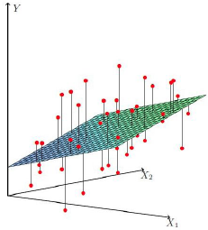
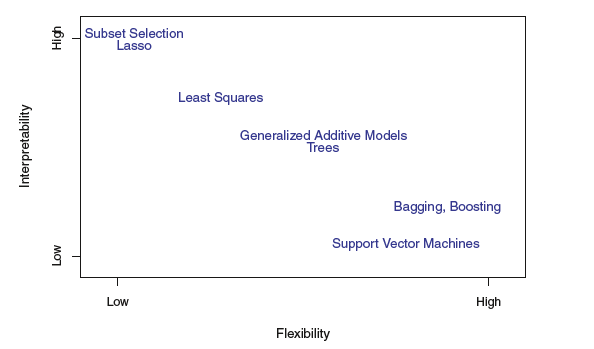
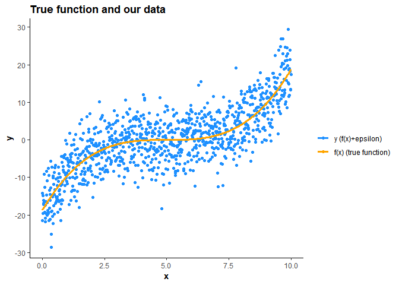
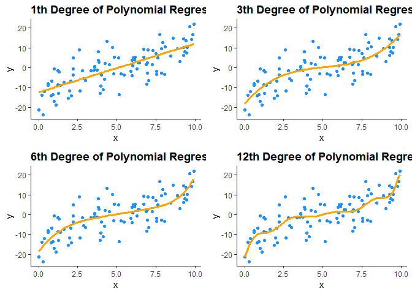
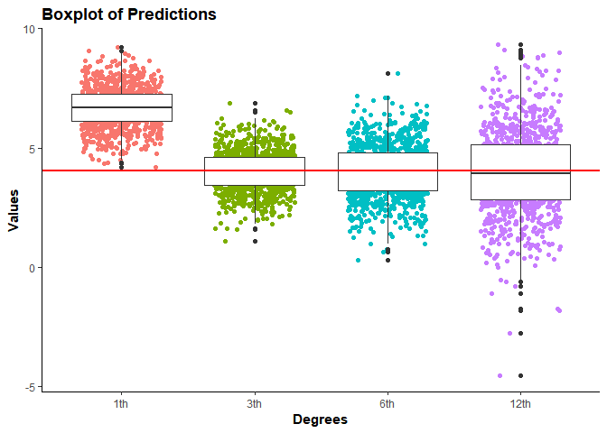
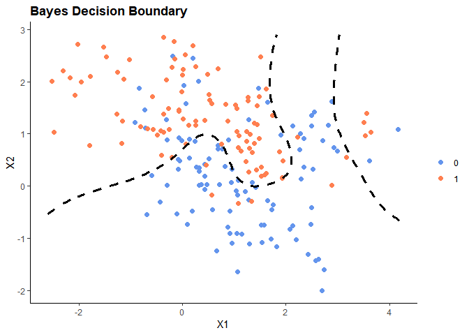
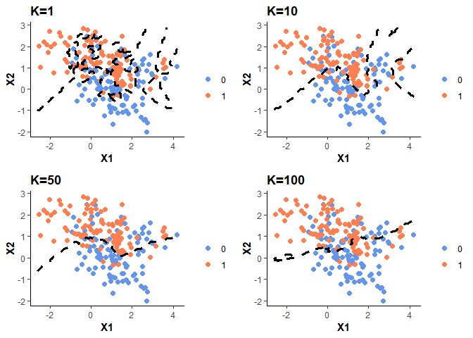
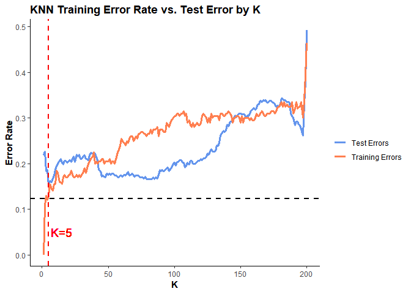

# 02 Statistical Learning

------------------------------------------------------------------------

#### Yeon Soo, Choi

------------------------------------------------------------------------


===================

What is Statistical Learning?
-----------------------------

------------------------------------------------------------------------

**통계적 학습**이란, **입력값** (Input Variables,  ) 과 **출력값** (Output Variables,  ) 이 주어졌을 때 다음과 같이

+\epsilon")

일반적인 형태로 입력값과 출력값의 관계를 설명할 수 있는    와   이 존재한다고 하면 이러한 가 가 에 대해 제공하는 systematic information을 대표한다고 책에서는 말한다. (여기서 말하는 systematic information이란 X와 Y의 실제적 인과관계가 아닌 주어진 정보 하에 function의 형태에서 얻어질 수 있는 두 관계에 대한 정보를 의미하는 것 같다.)

결론적으로, 통계적 학습은 이러한  를 추정하는 것을 의미하고 ISL 교재 내에서는 이러한  를 추정할 수 있는 다양한 방법론 그리고 이를 평가하는 방법들에 대해서 소개하고 있다.

------------------------------------------------------------------------

### Why Estimate  ?

------------------------------------------------------------------------

 를 추정하고자 하는 데에는 **prediction, inference**로 두 가지 이유가 있다.

------------------------------------------------------------------------

#### Prediction (예측)

------------------------------------------------------------------------

우리는 알지 못하는  에 대해 다음과 같이  로 예측을 할 수 있다. (error term이 averages to zero 라는 표현을 썼는데 ") 를 말하는 듯 함)

")

예측 관점에서는  에 대한 추정치  의 정확한 형태(formula)에는 관심이 없고 그저 에 대한 예측의 정확성에 관심이 있기 때문에 를 종종   로 취급한다.

여기서 말하는 **정확도()** 이란?

*Minimizing the Reducible Error!*

Regression Problem 에서 흔히 쓰이는 정확도(오차)에 대한 척도 **MSE**(*Mean Squared Error*)를 살펴보면

![E(Y-\\hat{Y})^2=E\[f(X)+\\epsilon-\\hat{f(X)}\]^2=\[f(X)-\\hat{f(X)}\]^2+E\[\\epsilon^2\]=](https://latex.codecogs.com/png.latex?E%28Y-%5Chat%7BY%7D%29%5E2%3DE%5Bf%28X%29%2B%5Cepsilon-%5Chat%7Bf%28X%29%7D%5D%5E2%3D%5Bf%28X%29-%5Chat%7Bf%28X%29%7D%5D%5E2%2BE%5B%5Cepsilon%5E2%5D%3D "E(Y-\hat{Y})^2=E[f(X)+\epsilon-\hat{f(X)}]^2=[f(X)-\hat{f(X)}]^2+E[\epsilon^2]=")

![\[f(X)-\\hat{f(X)}\]^2+Var(\\epsilon)](https://latex.codecogs.com/png.latex?%5Bf%28X%29-%5Chat%7Bf%28X%29%7D%5D%5E2%2BVar%28%5Cepsilon%29 "[f(X)-\hat{f(X)}]^2+Var(\epsilon)")

![Var(\\epsilon)=E\[(\\epsilon-E\[\\epsilon\])^2\]=E\[\\epsilon^2\]-0^2=E\[\\epsilon^2\]](https://latex.codecogs.com/png.latex?Var%28%5Cepsilon%29%3DE%5B%28%5Cepsilon-E%5B%5Cepsilon%5D%29%5E2%5D%3DE%5B%5Cepsilon%5E2%5D-0%5E2%3DE%5B%5Cepsilon%5E2%5D "Var(\epsilon)=E[(\epsilon-E[\epsilon])^2]=E[\epsilon^2]-0^2=E[\epsilon^2]")

다음과 같은 두 error에 대한 정의와 위 식을 살펴보면 Reducible Error는 우리가 보다 정확한 추정치를 찾는다면 줄일 수 있고 우리가 줄일 수 없는 Irreducible Error는 그 분산에 의존할 수 밖에 없기에 직관적으로도 이해 가능하다.

**1. Reducible error** - 적절한 통계적 학습 기술을 이용해 줄일 수 있는 

**2. Irreducible error** - 일종의 통계학에서 말하는  (를 설명가능한 변수의 부재,  이 측정 불가능한 변동성을 포함..etc)

(Why **MSE?**) 전체적인 오차에 대한 척도를 나타낼 때 그냥 평균을 내버리면 전체적인 오차가 얼마나 큰지 가늠할 수가 없다. 평균을 구할 때 합을 구해야하는데 오차가 아무리 커도 양수, 음수가 섞여 있으면 합이 0이 돼버리는 경우가 있기 때문. 따라서 부호를 없애기 위해 제곱을 선택한다... 때때로 MSE는 값이 너무 커서 계산 속도의 효율성을 위해 제곱근을 씌운 **RMSE(Root Mean Squared Error)** 를 사용하는 것이다.

------------------------------------------------------------------------

#### Inference (추론)

------------------------------------------------------------------------

위의 경우와 다르게 때때로 우리는  가  에 의해 어떻게 영향을 받는지에 대한 **해석**이 주된 관심이 될 수 있다.

이 경우 우리는 예측의 정확성보다는 와  의 관계에 대해 관심이 있기 때문에 이 경우 우리는  의 정확한 form 에 대해 알아야 한다. 이를테면

-   어떤 독립변수들이 종속변수와 관련이 있는가?
-   가 한 단위 변화할때 가 얼마나 증가(혹은 감소)하는가?
-   와 의 관계가 선형 방정식의 형태로 설명될 수 있는가? 아니면 더 복잡한 형태의 관계를 가지는가?

와 같은 문제들 말이다. 어떤 문제들의 경우 이러한 **추론**과 **예측**의 관점 두 가지가 모두 필요한 경우들도 있을 것이다.

------------------------------------------------------------------------

### Trade-Off Between Prediction Accuracy and Model Interpretability

------------------------------------------------------------------------

거의 대부분의 통계적 학습 모형들은 모수적 방법() 과 비모수적 방법() 으로 나타낼 수 있다.

-   **Parametric Methods**

1.  모형 가정 (ex. linear model)
2.  모형 추정 (model fit or train)

-   장점 : 모형 추정의 간편성
-   단점 :  의 True form과 맞지 않을 수 있다. flexible한 모형을 선택한다해도 overfitting 의 문제가 있을 수 있음

-   **Non-parametric Methods**

1.  모형 가정이 없음
2.  단지 관측값에 가장 가까운  를 찾을 뿐

-   장점 : 모형 가정이 없어 추정치의 가능한 형태가 보다 자유롭다. ( 의 True form과 보다 가까워질 수 있다.)
-   단점 : 매우 많은 관측치가 필요하다. overfitting의 문제

------------------------------------------------------------------------

#### Trade-Off Between Prediction Accuracy and Model Interpretability

------------------------------------------------------------------------


=======================

모형에 따른 **flexibility** 와 **interpretability** 의 **trade-off** 관계를 나타낸 그림은 위와 같다. 이를 통해 모형이 유연할수록 해석의 가능성은 떨어진다는 것을 확인할 수 있다.

추론이 주된  라면 모형의 해석을 위해 restrictive method 를 선호할 것이다.

------------------------------------------------------------------------

### Supervised Learning vs. Unsupervised Learning

------------------------------------------------------------------------

**Supervised Learning** 과 종속변수가 주어져있지 않는 **Unsupervised Learning** 에 대한 간단한 설명 그리고 개 그리고  ( &lt; )개의 관측치가 있다고 할 때 나머지 - 개의 관측치가 종속변수가 없다고 할 때의 경우인 **Semi-supervised Learning** 에 대해서도 책은 있다 정도만 소개하고 있다.

------------------------------------------------------------------------

### Regression vs. Classification

------------------------------------------------------------------------

종속변수가 **양적변수** ( Quantitative Variable ) 일 때의 **Regression Problem**, **질적변수** ( Quantitative Variable ) 일 때의 **Classification Problem** 에 대해 책에서는 정의하고 있다.

------------------------------------------------------------------------

Assessing Model Accuracy
------------------------

------------------------------------------------------------------------

좋은 결과를 위해서는 올바른 모형의 선택이 반드시 뒤따라야 할 것이다. 이를 위해 모형의 평가에 대한 이야기를 책에서는 다루고 있다.

------------------------------------------------------------------------

### Measuring the Quality of Fit

------------------------------------------------------------------------

모형의 성능을 평가하기 위해 예측치와 관측치가 잘 맞는지 확인해야 할 것이다.

)^2 ")

회귀 문제에서 가장 많이 사용하는 loss function인 **MSE**를 예로 들어 책에서는 모형의 성능을 평가하기 위해서는 **Training MSE** 보다 아직 관찰되지 않은 관측치에 대한 예측값의 **Test MSE**를 최소화하는 것이 중요하다고 설명한다.

대다수의 통계적 모형들은 주어진 Training set 하에서의 MSE를 최소화하는 계수를 추정하기 때문이다.

이에 대한 해결책으로의 **cross-validation** 과 같은 방법들은 이후에 다룬다.

------------------------------------------------------------------------

\[실습\] Bias - Variance Trade - Off
------------------------------------

------------------------------------------------------------------------

#### 고집이 센 사람 vs. 귀가 얇은 사람

지도학습 알고리즘에서 과다적합 상황에서는 편향이 낮고 분산은 높다고 하고, 과소적합 상황에서는 편향이 높고 분산이 낮다고 한다.

이에 대해 보다 깊은 이해를 위해 이론을 복습하고 직접 실습을 통해 몸으로 느껴보고 싶었다.

+\epsilon"), "),

")

이라고 할 때,

새로운 관측치 (,) 에 대한 **expected test MSE**은 다음과 같이 나타낼 수 있다.

![E\[(y\_0-\\hat{f}(x\_0))^2\]](https://latex.codecogs.com/png.latex?E%5B%28y_0-%5Chat%7Bf%7D%28x_0%29%29%5E2%5D "E[(y_0-\hat{f}(x_0))^2]")

먼저 **Bias**와 **Variance**에 대해 설명하면,

-   **추정치의 Bias **

true function  의 ") 과 예측값 ")의 **기댓값**의 차

왜 기댓값의 차일까?

이는 우리의 모델 가 **추정치**이며  이라는 사실에서 기인한다.

")에서 true function  는 fixed unknown function 이므로 ") 또한 상수이다. 따라서 ![E\[f(x\_0)\]=f(x\_0)](https://latex.codecogs.com/png.latex?E%5Bf%28x_0%29%5D%3Df%28x_0%29 "E[f(x_0)]=f(x_0)") , 이며 )=0") 이다.

따라서 **Bias**는 다음과 같이 수식으로 나타낼 수 있을 것이고

![Bias\[\\hat{f}(x\_0)\]=E\[\\hat{f}(x\_0)\]-f(x\_0)=E\[\\hat{f}(x\_0)-f(x\_0)\]](https://latex.codecogs.com/png.latex?Bias%5B%5Chat%7Bf%7D%28x_0%29%5D%3DE%5B%5Chat%7Bf%7D%28x_0%29%5D-f%28x_0%29%3DE%5B%5Chat%7Bf%7D%28x_0%29-f%28x_0%29%5D "Bias[\hat{f}(x_0)]=E[\hat{f}(x_0)]-f(x_0)=E[\hat{f}(x_0)-f(x_0)]")

**Bias의 제곱**은 다음과 같을 것이다.

![Bias^2\[\\hat{f}(x\_0)\]=E\[\\hat{f}(x\_0)\]^2+f(x\_0)^2-2E\[\\hat{f}(x\_0)\]f(x\_0)](https://latex.codecogs.com/png.latex?Bias%5E2%5B%5Chat%7Bf%7D%28x_0%29%5D%3DE%5B%5Chat%7Bf%7D%28x_0%29%5D%5E2%2Bf%28x_0%29%5E2-2E%5B%5Chat%7Bf%7D%28x_0%29%5Df%28x_0%29 "Bias^2[\hat{f}(x_0)]=E[\hat{f}(x_0)]^2+f(x_0)^2-2E[\hat{f}(x_0)]f(x_0)")

-   **추정치의 Variance**

예측치가 평균적으로 그 평균에서 얼마만큼의 폭으로 변동하느냐에 대한 의미

분산이 크다는 것은 예측치의 범위가 넓다는 것이고, 이런 모델에서 이상치가 예측의 범위에 포함되어있을 수 있었으므로 **(Noise까지 Signal로 인식했다는 표현이 더 적절할 것 같다)** 과도적합이 되었을 수 있음을 의미한다.

따라서 반대로 과소적합의 경우에 분산이 작다는 것은 예측치의 범위가 좁다는 것이고, 이는 실제 맞는 데이터도 예측의 범위에 포함이 안되어 예측이 불가능하다는 것을 의미한다. **(Signal 까지 Noise로 취급)**

따라서 **Variance**는 다음과 같이 수식으로 나타낼 수 있을 것이다.

![Var(\\hat{f}(x\_0))=E\[(\\hat{f}(x\_0)-E\[\\hat{f}(x\_0)\])^2\]](https://latex.codecogs.com/png.latex?Var%28%5Chat%7Bf%7D%28x_0%29%29%3DE%5B%28%5Chat%7Bf%7D%28x_0%29-E%5B%5Chat%7Bf%7D%28x_0%29%5D%29%5E2%5D "Var(\hat{f}(x_0))=E[(\hat{f}(x_0)-E[\hat{f}(x_0)])^2]")

-   **expected Test MSE**

 , ")는 실재하는 값이고, ![E\[\\epsilon\]=0,~E\[y\_0\]=f(x\_0),~Var(y\_0)=\\sigma^2](https://latex.codecogs.com/png.latex?E%5B%5Cepsilon%5D%3D0%2C~E%5By_0%5D%3Df%28x_0%29%2C~Var%28y_0%29%3D%5Csigma%5E2 "E[\epsilon]=0,~E[y_0]=f(x_0),~Var(y_0)=\sigma^2") 이며 추정치인 ") 는  이기 때문에,

![Test \\ MSE=E\[(y\_0-\\hat{f}(x\_0))^2\]=E\[(y\_0-f(x\_0)+f(x\_0)-\\hat{f}(x\_0))^2\]=](https://latex.codecogs.com/png.latex?Test%20%5C%20MSE%3DE%5B%28y_0-%5Chat%7Bf%7D%28x_0%29%29%5E2%5D%3DE%5B%28y_0-f%28x_0%29%2Bf%28x_0%29-%5Chat%7Bf%7D%28x_0%29%29%5E2%5D%3D "Test \ MSE=E[(y_0-\hat{f}(x_0))^2]=E[(y_0-f(x_0)+f(x_0)-\hat{f}(x_0))^2]=") ![E\[(y\_0-f(x\_0))^2+(f(x\_0)-\\hat{f}(x\_0))^2+2(y\_0-f(x\_0))(f(x\_0)-\\hat{f}(x\_0))\]=](https://latex.codecogs.com/png.latex?E%5B%28y_0-f%28x_0%29%29%5E2%2B%28f%28x_0%29-%5Chat%7Bf%7D%28x_0%29%29%5E2%2B2%28y_0-f%28x_0%29%29%28f%28x_0%29-%5Chat%7Bf%7D%28x_0%29%29%5D%3D "E[(y_0-f(x_0))^2+(f(x_0)-\hat{f}(x_0))^2+2(y_0-f(x_0))(f(x_0)-\hat{f}(x_0))]=")

![Var(y\_0)+E\[(\\hat{f}(x\_0)-f(x\_0))^2\]+2E\[(y\_0-f(x\_0))(f(x\_0)-\\hat{f}(x\_0))\]](https://latex.codecogs.com/png.latex?Var%28y_0%29%2BE%5B%28%5Chat%7Bf%7D%28x_0%29-f%28x_0%29%29%5E2%5D%2B2E%5B%28y_0-f%28x_0%29%29%28f%28x_0%29-%5Chat%7Bf%7D%28x_0%29%29%5D "Var(y_0)+E[(\hat{f}(x_0)-f(x_0))^2]+2E[(y_0-f(x_0))(f(x_0)-\hat{f}(x_0))]")

이다.

여기서

![E\[(\\hat{f}(x\_0)-f(x\_0))^2\]=E\[(\\hat{f}(x\_0)-E\[\\hat{f}(x\_0)\]+E\[\\hat{f}(x\_0)\]-f(x\_0))^2\]=](https://latex.codecogs.com/png.latex?E%5B%28%5Chat%7Bf%7D%28x_0%29-f%28x_0%29%29%5E2%5D%3DE%5B%28%5Chat%7Bf%7D%28x_0%29-E%5B%5Chat%7Bf%7D%28x_0%29%5D%2BE%5B%5Chat%7Bf%7D%28x_0%29%5D-f%28x_0%29%29%5E2%5D%3D "E[(\hat{f}(x_0)-f(x_0))^2]=E[(\hat{f}(x_0)-E[\hat{f}(x_0)]+E[\hat{f}(x_0)]-f(x_0))^2]=")

![E\[(\\hat{f}(x\_0)-E\[\\hat{f}(x\_0)\])^2\]+(E\[\\hat{f}(x\_0)\]-f(x\_0))^2 +](https://latex.codecogs.com/png.latex?E%5B%28%5Chat%7Bf%7D%28x_0%29-E%5B%5Chat%7Bf%7D%28x_0%29%5D%29%5E2%5D%2B%28E%5B%5Chat%7Bf%7D%28x_0%29%5D-f%28x_0%29%29%5E2%20%2B "E[(\hat{f}(x_0)-E[\hat{f}(x_0)])^2]+(E[\hat{f}(x_0)]-f(x_0))^2 +")

![2E\[(\\hat{f}(x\_0)-E\[\\hat{f}(x\_0)\])(E\[\\hat{f}(x\_0)\]-f(x\_0))\]=](https://latex.codecogs.com/png.latex?2E%5B%28%5Chat%7Bf%7D%28x_0%29-E%5B%5Chat%7Bf%7D%28x_0%29%5D%29%28E%5B%5Chat%7Bf%7D%28x_0%29%5D-f%28x_0%29%29%5D%3D "2E[(\hat{f}(x_0)-E[\hat{f}(x_0)])(E[\hat{f}(x_0)]-f(x_0))]=")

![Var(\\hat{f}(x\_0))+Bias^2\[\\hat{f}(x\_0)\]+2E\[(\\hat{f}(x\_0)-E\[\\hat{f}(x\_0)\])(E\[\\hat{f}(x\_0)\]-f(x\_0))\]](https://latex.codecogs.com/png.latex?Var%28%5Chat%7Bf%7D%28x_0%29%29%2BBias%5E2%5B%5Chat%7Bf%7D%28x_0%29%5D%2B2E%5B%28%5Chat%7Bf%7D%28x_0%29-E%5B%5Chat%7Bf%7D%28x_0%29%5D%29%28E%5B%5Chat%7Bf%7D%28x_0%29%5D-f%28x_0%29%29%5D "Var(\hat{f}(x_0))+Bias^2[\hat{f}(x_0)]+2E[(\hat{f}(x_0)-E[\hat{f}(x_0)])(E[\hat{f}(x_0)]-f(x_0))]")

이고

아래의 Cross-Product Term들은 그 결과가 0이므로

-   ![E\[(y\_0-f(x\_0))(f(x\_0)-\\hat{f}(x\_0))\]](https://latex.codecogs.com/png.latex?E%5B%28y_0-f%28x_0%29%29%28f%28x_0%29-%5Chat%7Bf%7D%28x_0%29%29%5D "E[(y_0-f(x_0))(f(x_0)-\hat{f}(x_0))]")

![E\[(y\_0-f(x\_0))(f(x\_0)-\\hat{f}(x\_0))\]=E\[y\_0f(x\_0)-f(x\_0)^2-y\_0\\hat{f}(x\_0)+f(x\_0)\\hat{f}(x\_0)\]=](https://latex.codecogs.com/png.latex?E%5B%28y_0-f%28x_0%29%29%28f%28x_0%29-%5Chat%7Bf%7D%28x_0%29%29%5D%3DE%5By_0f%28x_0%29-f%28x_0%29%5E2-y_0%5Chat%7Bf%7D%28x_0%29%2Bf%28x_0%29%5Chat%7Bf%7D%28x_0%29%5D%3D "E[(y_0-f(x_0))(f(x_0)-\hat{f}(x_0))]=E[y_0f(x_0)-f(x_0)^2-y_0\hat{f}(x_0)+f(x_0)\hat{f}(x_0)]=")

![f(x\_0)^2-f(x\_0)^2-E\[y\_0\\hat{f}(x\_0)\]+f(x\_0)E\[\\hat{f}(x\_0)\]=](https://latex.codecogs.com/png.latex?f%28x_0%29%5E2-f%28x_0%29%5E2-E%5By_0%5Chat%7Bf%7D%28x_0%29%5D%2Bf%28x_0%29E%5B%5Chat%7Bf%7D%28x_0%29%5D%3D "f(x_0)^2-f(x_0)^2-E[y_0\hat{f}(x_0)]+f(x_0)E[\hat{f}(x_0)]=")

![-E\[(f(x\_0)+\\epsilon)\\hat{f}(x\_0)\]+f(x\_0)E\[\\hat{f}(x\_0)\]=](https://latex.codecogs.com/png.latex?-E%5B%28f%28x_0%29%2B%5Cepsilon%29%5Chat%7Bf%7D%28x_0%29%5D%2Bf%28x_0%29E%5B%5Chat%7Bf%7D%28x_0%29%5D%3D "-E[(f(x_0)+\epsilon)\hat{f}(x_0)]+f(x_0)E[\hat{f}(x_0)]=")

![-E\[f(x\_0)\\hat{f}(x\_0)\]-E\[\\epsilon\\hat{f}(x\_0)\]+f(x\_0)E\[\\hat{f}(x\_0)\]=0](https://latex.codecogs.com/png.latex?-E%5Bf%28x_0%29%5Chat%7Bf%7D%28x_0%29%5D-E%5B%5Cepsilon%5Chat%7Bf%7D%28x_0%29%5D%2Bf%28x_0%29E%5B%5Chat%7Bf%7D%28x_0%29%5D%3D0 "-E[f(x_0)\hat{f}(x_0)]-E[\epsilon\hat{f}(x_0)]+f(x_0)E[\hat{f}(x_0)]=0")

-   ![E\[(\\hat{f}(x\_0)-E\[\\hat{f}(x\_0)\])(E\[\\hat{f}(x\_0)\]-f(x\_0))\]](https://latex.codecogs.com/png.latex?E%5B%28%5Chat%7Bf%7D%28x_0%29-E%5B%5Chat%7Bf%7D%28x_0%29%5D%29%28E%5B%5Chat%7Bf%7D%28x_0%29%5D-f%28x_0%29%29%5D "E[(\hat{f}(x_0)-E[\hat{f}(x_0)])(E[\hat{f}(x_0)]-f(x_0))]")

![E\[(\\hat{f}(x\_0)-E\[\\hat{f}(x\_0)\])(E\[\\hat{f}(x\_0)\]-f(x\_0))\]=](https://latex.codecogs.com/png.latex?E%5B%28%5Chat%7Bf%7D%28x_0%29-E%5B%5Chat%7Bf%7D%28x_0%29%5D%29%28E%5B%5Chat%7Bf%7D%28x_0%29%5D-f%28x_0%29%29%5D%3D "E[(\hat{f}(x_0)-E[\hat{f}(x_0)])(E[\hat{f}(x_0)]-f(x_0))]=")

![E\[\\hat{f}(x\_0)E\[\\hat{f}(x\_0)\]-E\[\\hat{f}(x\_0)\]E\[\\hat{f}(x\_0)\]-](https://latex.codecogs.com/png.latex?E%5B%5Chat%7Bf%7D%28x_0%29E%5B%5Chat%7Bf%7D%28x_0%29%5D-E%5B%5Chat%7Bf%7D%28x_0%29%5DE%5B%5Chat%7Bf%7D%28x_0%29%5D- "E[\hat{f}(x_0)E[\hat{f}(x_0)]-E[\hat{f}(x_0)]E[\hat{f}(x_0)]-")

![\\hat{f}(x\_0)f(x\_0)+E\[\\hat{f}(x\_0)\]f(x\_0)\]=](https://latex.codecogs.com/png.latex?%5Chat%7Bf%7D%28x_0%29f%28x_0%29%2BE%5B%5Chat%7Bf%7D%28x_0%29%5Df%28x_0%29%5D%3D "\hat{f}(x_0)f(x_0)+E[\hat{f}(x_0)]f(x_0)]=")

![E\[\\hat{f}(x\_0)\]E\[\\hat{f}(x\_0)\]-E\[\\hat{f}(x\_0)\]E\[\\hat{f}(x\_0)\]-E\[\\hat{f}(x\_0)\]f(x\_0)+E\[\\hat{f}(x\_0)\]f(x\_0)=0](https://latex.codecogs.com/png.latex?E%5B%5Chat%7Bf%7D%28x_0%29%5DE%5B%5Chat%7Bf%7D%28x_0%29%5D-E%5B%5Chat%7Bf%7D%28x_0%29%5DE%5B%5Chat%7Bf%7D%28x_0%29%5D-E%5B%5Chat%7Bf%7D%28x_0%29%5Df%28x_0%29%2BE%5B%5Chat%7Bf%7D%28x_0%29%5Df%28x_0%29%3D0 "E[\hat{f}(x_0)]E[\hat{f}(x_0)]-E[\hat{f}(x_0)]E[\hat{f}(x_0)]-E[\hat{f}(x_0)]f(x_0)+E[\hat{f}(x_0)]f(x_0)=0")

최종적인 **expected Test MSE**는 다음과 같이 분해될 수 있다.

![E\[y\_0-\\hat{f}(x\_0))^2\]=Bias^2\[\\hat{f}(x\_0)\]+Var(\\hat{f}(x\_0))+Var(\\epsilon)](https://latex.codecogs.com/png.latex?E%5By_0-%5Chat%7Bf%7D%28x_0%29%29%5E2%5D%3DBias%5E2%5B%5Chat%7Bf%7D%28x_0%29%5D%2BVar%28%5Chat%7Bf%7D%28x_0%29%29%2BVar%28%5Cepsilon%29 "E[y_0-\hat{f}(x_0))^2]=Bias^2[\hat{f}(x_0)]+Var(\hat{f}(x_0))+Var(\epsilon)")

------------------------------------------------------------------------

### Simulation (Regression)

------------------------------------------------------------------------

이제 이에 대한 내용을 직접 시뮬레이션하여 확인해보는 작업을 수행하였다.

**Note :** 위의 Bias와 Variance 는 확률론적 **기댓값**이다. 따라서 이를 추정하기 위해서는 번의 시뮬레이션을 통해 얻은 개의 추정치들의 평균으로 구해야하며 따라서 추정치가 **'여러 개'** 여야한다.

이는 결국 같은 차수(Complexity)에 대한 모델 또한 여러 개여야 한다는 말이고 이는 true function을 안다면 그 true function 하의 표본크기 의 샘플 { (,),(,),...,(,)} 들을 반복적으로 추출하여 모델을 반복적으로 적합하는 과정이 필요하다는 것을 의미한다.

이를 위해 시뮬레이션을 진행해야하는데 샘플을 얻기 위해 다음과 같이 우리의 true function 를 안다는 가정하에 와 train 데이터를 generate 하는 process에 대해 정의해야한다.

단계는 이렇다.

**1.** =")+ 의 **true function 를 안다고 가정**하고 주어진 정의역 하에서 Train Set 과 Test Observation을 정의하여 Train Set에서 표본 크기가 개인 표본을 시뮬레이션 횟수 번 만큼 반복적으로 추출한다.

**2.** **Polynomial Regression**으로 차수를 1,3,6,12로 늘려가며 4개의 모델을 번의 매 시뮬레이션 마다 적합한다.

**3.** 차수 별로 Test Observation에 대한 개의 추정치가 있을 것이다. 차수 별 **Variance** 와 **Bias**, 이에 따른 **MSE**를 계산하여 비교한다.

**Training MSE**, **TEST MSE**, **Bias**와 **Variance** 를 계산하는 함수를 정의한다.

``` r
## MSE function for Training MSE and Expected TEST MSE

mse=function(pred,test){
  return (mean((test-pred)^2))
}

## Bias of estimates

bias=function(pred,test){
  return (mean(pred)-test)
}

## Variance of estimates

variance=function(pred,test){
  return (mean((pred-mean(pred))^2))
}
```

표본 크기 은 100, 시뮬레이션 횟수  은 1000번 수행하기로 하였다.

우리가 다 안다는 가정 하에 true function  와 irreducible error 를 다음과 같이 정의하고

^3+\epsilon,~~(\epsilon\sim~N(0,5^2) )~~(0<=x<=10)")

 test observation ") 을 +\epsilon)") 으로 설정하여

") 을 제외한 모든 구간에서 train sample을 추출하는 `get_sim` 함수를 정의한다.

``` r
## define true function

f=function(x){
  return (0.15*(x-5)^3)
}

## train data generating function

get_sim=function(f,sample_size=100){
  ## train 
  while (TRUE){
    x=runif(n=sample_size,0,10)
    if (!(8 %in% x)){
      break
    }
    }
  ## epsilon
  epsilon=rnorm(n=sample_size,mean=0,sd=5)
  ## y
  y=f(x)+epsilon
  data=data.frame(x,y)
  return (data)
}
```

위와 같이 정의한 정의역에서 true function  하의 전체 데이터가 있다고 가정 하면 **대략** 이런 형태가 될 것이다.

``` r
x=seq(0,10,by=0.01)
epsilon=rnorm(length(x),sd=5)
y=f(x)+epsilon
example=data.frame(x,y)
ggplot(example)+
  geom_point(aes(x,y,color='dodgerblue'))+
  geom_line(aes(x,f(x),color='orange'),lwd=1.2)+
  theme_classic()+
  scale_colour_manual(name='',
                      values=c('dodgerblue'='dodgerblue','orange'='orange'),labels=c('y (f(x)+epsilon)','f(x) (true function)'))+
  ggtitle('True function and our data')+
  theme(axis.title=element_text(face='bold'))+
  theme(plot.title=element_text(face='bold'))
```



이렇게 셋팅을 하고 **sample size**가 **100**인 **1000** (simulation 횟수) 개의 train set 를 generate 했으며 각각의 데이터셋 ,,... 에 대해 1, 3, 6, 12로 차수를 늘려가며 4개의 다항회귀모형을 적합하였고,

Bias 와 Variance의 추정치를 계산하고 비교를 위해 new observation을 (, ) (+\epsilon)")) 를 정의하였으며 예측치들을 `predictions` 이라는 행렬로 저장하였다.

``` r
## number of simulations
n_sim = 1000
## number of models
n_model = 4
degrees=c(1,3,6,12)


## predictions
predictions=matrix(0,nrow=n_sim,ncol=n_model)
```

이제 각 모델 4개의  에서의  에 대한 예측치 들은 이러한 형태가 될 것이고,

 = ") = 

 = ") = 

 = ") = 

 = ") = 

``` r
set.seed(2013122044)
sim_data=get_sim(f,100)
for (i in degrees){
  poly=lm(y~poly(x,i),data=sim_data)
  pred=predict(poly,newdata=sim_data)
  name=paste0('plot',i)
  assign(name,ggplot(data=sim_data,aes(x=x,y=y))+
           geom_point(col='dodgerblue')+
           geom_line(aes_string(x=sim_data$x,y=pred),color='orange',lwd=1.2)+
           theme_classic()+
    ggtitle(paste0(i,'th Degree of Polynomial Regression Model'))+
      theme(plot.title=element_text(face='bold')))
}

grid.arrange(plot1,plot3,plot6,plot12,
             nrow=2,ncol=2)
```



차수 별 fitted line은 위의 형태와 같을 것이다.

1000회의 시뮬레이션을 거쳐 확인한 결과는 다음과 같다.

``` r
## Bias - Variance Trade-Off Simulation 
options(scipen=999)
set.seed(2013122044)
y=c()
## 1000 simulations
for (sim in 1:n_sim){
  
  ## generate dataset with sample size 100
  sim_data=get_sim(f,100)
  new_data=data.frame(x=8,y=f(8)+rnorm(1,0,5))
  y=append(y,new_data$y)
  
  ## model fitting and predictions
  for (j in 1:length(degrees)){
    fit=lm(y ~ poly(x,degrees[j]),data=sim_data)
    predictions[sim,j]=predict(fit,newdata=new_data)
  }
}

predictions=data.frame(predictions)
colnames(predictions)=c('1th','3th','6th','12th')


ggplot(data =melt(predictions),aes(x=variable, y=value))+
  geom_jitter(aes(color=variable),width=0.3)+
  geom_boxplot()+
  theme_classic()+
  geom_hline(yintercept = f(8),color='red',lwd=1)+
  xlab('Degrees')+
  ylab('Values')+
  theme(legend.position="none")+
  ggtitle('Boxplot of Predictions')+
  theme(axis.title=element_text(face='bold'))+
  theme(plot.title=element_text(face='bold'))
```

    ## No id variables; using all as measure variables



빨간선이 true function 하의 = f(8)") 값이고 점들은 각 다항회귀의 차수에 대한 모델의 예측값을 나타낸다.

각각의 차수에 대해 Test observation 에 대한 **Test~MSE**와 **Bias^2**, **Variance**를 계산한 결과는 다음과 같다.

``` r
## Test MSE
test_mse=apply(predictions,2,mse,test=y)

## Bias^2
bias_squared=(apply(predictions,2,bias,test=f(8)))^2
## Variance
var=apply(predictions,2,variance,test=f(8))

results=data.frame('Test MSE'=test_mse,'Bias Squared'=bias_squared,'Variance'=var)

kable(results,format='markdown') 
```

|      |  Test.MSE|  Bias.Squared|   Variance|
|:-----|---------:|-------------:|----------:|
| 1th  |  32.09436|     6.9552496|  0.6985917|
| 3th  |  25.39866|     0.0014614|  0.7204642|
| 6th  |  26.03019|     0.0011937|  1.3122572|
| 12th |  27.99150|     0.0047051|  3.0742542|

3차 다항회귀를 적합했을때, 우리가 알고있다고 가정한 true function  가 3차함수였으므로 Test MSE가 가장 작다고 유추할 수 있다.

**Note :** 정의한 함수로 계산되는 Test MSE를 보면 정확히 Bias의 제곱과 Variance의 합이 아님을 알 수 있다.

정의대로면 추가적으로 ~\approx25") 가 고려되어야 하기 때문이다.

------------------------------------------------------------------------

### Simulation (Classification)

------------------------------------------------------------------------

위의 회귀 문제가 아닌 분류 문제일때는 어떨까?

이 경우는 Train Observations { ") ,,, ") } 로 똑같이  에 대해 추정하는 것이다. 다만 종속변수  가 **qualitative** (질적변수) 인 것이다.

이 경우 모델의 정확도를 평가하는 지표로 \*\* Training Error Rate \*\* 를 자주 사용하는데 이는 우리의 추정 모델 ") 가 train observation들에 대해 맞추지 못한 비율로 모델의 정확도를 평가한다.

")

``` r
## error rate

error_rate=function(pred,test){
  mistakes=c()
  for (i in 1:length(test)){
    if (pred[i]!=test[i]){
      mistakes[i]=1
    }
    else{
      mistakes[i]=0
    }
  }
  return (mean(mistakes))
}
```

위의 수식에서 ") 은 *indicator variable* 로 예측치와 관측치가 같다면 0, 다르다면 1로써 error rate를 계산할 것이다.

위의 회귀 문제처럼 **Test Error Rate** 를 최소화하기 위한 과정에서 분류 문제 또한 **Bias & Variance Trade Off** 가 적용된다.

책에서는 Bayes Classifier 와 KNN에 대한 아주 간단한 설명과 함께 두 가지 방법론에 대해 이를 설명하고 있기에 직접 확인해보았다.

------------------------------------------------------------------------

#### Bayes Classifier

------------------------------------------------------------------------

매우 단순한 분류기에 해당하는 베이즈 분류기는 주어진 각각의 독립변수 값에 대해 **가장 그럴듯한** (maximum likelihood) class에 종속 변수 값을 할당하는 **조건부 확률 모델**이다.

즉, 만일 class가 1과 2로 binary classification 문제라고 가정하면 베이즈 분류기는 조건부 확률은 주어진 독립변수값  하에서 >0.5") 라면 class 1으로 분류하는 것이고, 아니라면 2로 분류하는 것이다.

베이즈 분류기는 이론적인 **실제 조건부 확률 분포** ") 를 알기 때문에 어떠한 Test set 이 주어져도 Test error rate를 최소화하는 **규칙**이고 이를 따라서 **Bayes error rate** 라고 한다. 즉, 책에서 말하는 \*\*irreducible error\*에 해당한다고 할 수 있다.

즉, 베이즈 분류기는 위의 **Regression** 의 예시에서 제시한 일종의 true function 을 안다고 할 수 있는 확률 모형이기 때문에 Validation 의 과정도 필요없고 영원히 도달할 수 없는 궁극의 목표같은 것이다.

베이즈 분류기를 쓴다면 참 좋겠지만 실제로 우리는 우리의 observation 들이 generate되는 process (true function) 에 대해 알지 못하므로 조건부 확률 ") 를 계산하는 것이 불가능하다. 따라서 이러한 조건부 확률을 추정하여 클래스에 속할 **추정된 확률**이 가장 큰 클래스로 분류 해야하는데 조건부 확률을 추정하는 방법이 여러가지가 있고 이 중 하나가 KNN이다.

------------------------------------------------------------------------

#### KNN (K-Nearest Neighbors)

------------------------------------------------------------------------

KNN은 Test observation  이 주어졌을 때  근처의 가장 가까운 값  개 관측치를 Train data에서 찾는다.

그 관측치들 중 class가 j인 부분들이 있을 것이고, 그 다음 class j에 속할 조건부 확률들을 K개의 이웃들로 계산하는 것이다. 아래와 같이 계산한다.

=\frac{1}{K}\Sigma~I(y_i=j)")

최종적으로 이렇게 추정된 조건부 확률들로 베이즈 정리를 이용하여 test observation  를 가장 속할 확률이 높은 class에 분류하는 것이다.

예를 들면,  가 1이면 무조건 제일 가까운 관측치와 같은 클래스로 분류될 것이고 Train observation이 100개인데  가 100이면 전체 Train data에서 제일 많은 클래스로 분류해버릴 것이다.

이웃 한명 말만 듣고 결정하는 것과 100명 말을 듣고 결정하는 것, KNN의 경우 또한 모델의 복잡도에 따른 **Bias-Variance Trade off** 가 존재할 것이다.

`ElemStatLearn` 패키지에 있는 실습 자료 `mixture.example` 을 이용해 K값을 달리해보며 분류 모델을 적합한 결과는 다음과 같다.

**Note** : 확률 분포를 가정하여 generate한 데이터지만 실습을 위해 확률분포를 모른다고 가정하고 KNN 모델을 적합하였다.

먼저 데이터셋에는 조건부 확률값들이 주어져 있다. 따라서 이를 토대로 **Bayes Decision Boundary**를 나타낸 결과는 다음과 같다.

``` r
## data

X1_train=mixture.example$x[,1]
X2_train=mixture.example$x[,2]

Y=mixture.example$y
Y=factor(Y)

knn_train=data.frame(X1=X1_train,X2=X2_train,Y=Y)
knn_test=data.frame(X1=mixture.example$xnew[,1],X2=mixture.example$xnew[,2])

px1=mixture.example$px1
px2=mixture.example$px2
prob=mixture.example$prob
prob=matrix(prob, length(px1), length(px2))
bdb=data.frame(expand.grid(x=px1, y=px2),c(prob))
colnames(bdb)=c('x','y','prob')

ggplot(knn_train)+
    geom_point(aes(x=X1,y=X2,color=Y),size=2)+
    stat_contour(data=bdb,aes_string(x=bdb$x,y=bdb$y,z=bdb$prob),color='black',lwd=1.2,lty='dashed',breaks=0.5)+
    scale_colour_manual(name='', values=c('0'='cornflowerblue','1'='coral'),labels=c('0','1'))+
    theme_classic()+
    ggtitle(paste0('Bayes Decision Boundary'))+
  theme(plot.title=element_text(face='bold'))
```



또한, 조건부 확률 분포가 주어져 있으므로 주어진  하에 확률이 가장 큰  를 선택했을 때 발생하는 오차값인 **Bayes Error Rate** 는 대략 0.1232의 값을 가진다.

``` r
## Bayes error rate
set.seed(2013122044)

y_bayes=rep(0,6831)
for (j in 1:6831){
  if (bdb$prob[j] > 0.5){
    y_bayes[j]=1
  }
  else if (bdb$prob[j] < 0.5){
    y_bayes[j]=0
  }
  else {
    y_bayes[j]=sample(c(1,0),1,prob=c(bdb$prob[j],1-bdb$prob[j]))
  }
}

bayes_error=c()
for (i in 1:100){
  y_real=rep(0,6831)
  for (j in 1:6831){
    y_real[j]=sample(c(1,0),1,prob=c(bdb$prob[j],1-bdb$prob[j]))
  }
  bayes_error=append(bayes_error,error_rate(y_bayes,y_real))
}

bayes_error=mean(bayes_error)
```

위의 자료로 K값을 1,10,50,100까지 늘려가며 KNN 분류 모델을 적합해 **KNN Decision Boundary** 을 나타낸 결과는 다음과 같다.

``` r
## fit
ks=c(1,10,50,100)
for (i in ks){
  model=knn(knn_train[,-3],knn_test,knn_train$Y,k=i,prob=TRUE)
  prob=attr(model, "prob")
  prob=ifelse(model=="1", prob, 1-prob)
  px1=mixture.example$px1
  px2=mixture.example$px2
  prob=matrix(prob, length(px1), length(px2))
  kdb=data.frame(expand.grid(x=px1, y=px2),c(prob))
  colnames(kdb)=c('x','y','prob')

  name=paste0('k',i)
  assign(name,ggplot(knn_train)+
    geom_point(aes(x=X1,y=X2,color=Y),size=2)+
    stat_contour(data=kdb,aes_string(x=kdb$x,y=kdb$y,z=kdb$prob),color='black',lwd=1.2,lty='dashed',breaks=0.5)+
    scale_colour_manual(name='', values=c('0'='cornflowerblue','1'='coral'),labels=c('0','1'))+
    theme_classic()+
    ggtitle(paste0('K=',i))+
      theme(axis.title=element_text(face='bold'))+
      theme(plot.title=element_text(face='bold'))
      
  )
}

grid.arrange(k1,k10,k50,k100,nrow=2,ncol=2)
```



이제 데이터셋에 주어진 조건부 확률분포 `prob` ![(Pr(Y=1|x\_0=\[x\_1~x\_2\]^T))](https://latex.codecogs.com/png.latex?%28Pr%28Y%3D1%7Cx_0%3D%5Bx_1~x_2%5D%5ET%29%29 "(Pr(Y=1|x_0=[x_1~x_2]^T))") 을 이용해 500개의 test observation을 generate 해서 K를 1부터 200까지 설정할 때마다 **Training Error Rate** 와 **Test Error Rate** 가 어떻게 변하는지 확인해본 결과는 다음과 같다.

``` r
## test set generation
set.seed(2013122044)
X1=sample(px1,500,replace=TRUE)
X2=sample(px2,500,replace=TRUE)

idx=c()
for (i in 1:500){
  idx=append(idx,which(bdb$x==X1[i] & bdb$y==X2[i]))
}

prob=bdb$prob[idx]

## test y

y=rep(0,500)
for (i in 1:500){
  y[i]=sample(c(1,0),1,prob=c(prob[i],1-prob[i]))
}

## test df

knn_test=data.frame(X1=X1,X2=X2,Y=y)

##training error rate and test error rate

train_error=c()
test_error=c()


for (i in 1:200){
  train=knn(knn_train[,-3],knn_train[,-3],knn_train$Y,k=i,prob=TRUE)
  test=knn(knn_train[,-3],knn_test[,-3],knn_train$Y,k=i,prob=TRUE)
  train_error=append(train_error,error_rate(train,knn_train$Y))
  test_error=append(test_error,error_rate(test,knn_test$Y))
}
## results df
K=1:200
error=c(rep('Train Error',200),rep('Test Error',200))
results=data.frame(c(train_error,test_error),error,K)
colnames(results)=c('Value','Error','K')

ggplot(results)+
  geom_line(aes(x=K,y=Value,color=Error),lwd=1.2)+
  theme_classic()+
  scale_colour_manual(name='', values=c('Test Error'='cornflowerblue','Train Error'='coral'),labels=c('Test Errors','Training Errors'))+
  geom_hline(yintercept = bayes_error,lwd=1,lty='dashed')+
  ylab('Error Rate')+
  geom_vline(xintercept = which(test_error==min(test_error)),color='red',lwd=1,lty='dashed')+
  geom_text(aes(x=15, label="K=5", y=0.05), colour="red",size=5)+
  ylab('Error Rate')+
  ggtitle('KNN Training Error Rate vs. Test Error by K')+
  theme(axis.title=element_text(face='bold'))+
  theme(plot.title=element_text(face='bold'))
```



위 그래프에서 검은색 점선이 바로 **Bayes Decision Boundary** 이고, 빨간색 점선이 Test Error가 최솟값을 갖는 **K=5** 를 나타낸다.

이렇게 회귀와 분류 문제 모두 모델의 적절한 복잡도를 선택하는 것이 좋은 통계 학습 모델의 필수 조건이라는 것을 확인하였다.

첫단원이라 추정량이나 모델에 대한 자세한 설명이 없어서 이해가 부족한 부분이 있으나 직접 이론을 공부하고 구현해보며 더 깊은 이해를 할 수 있었다.
