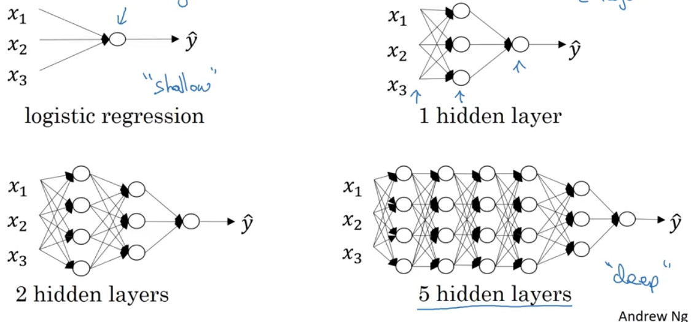
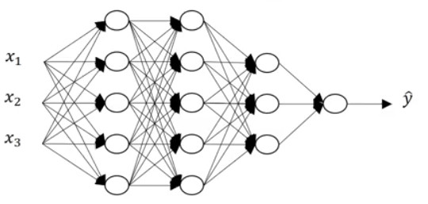
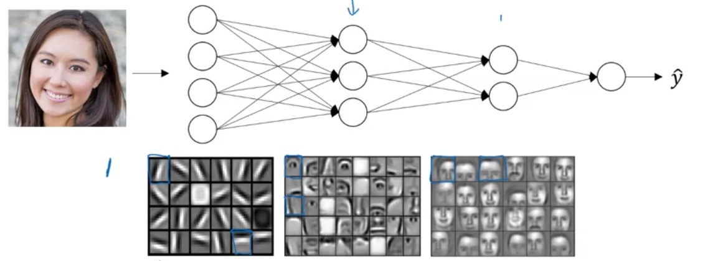
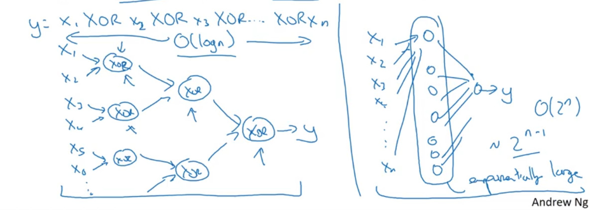
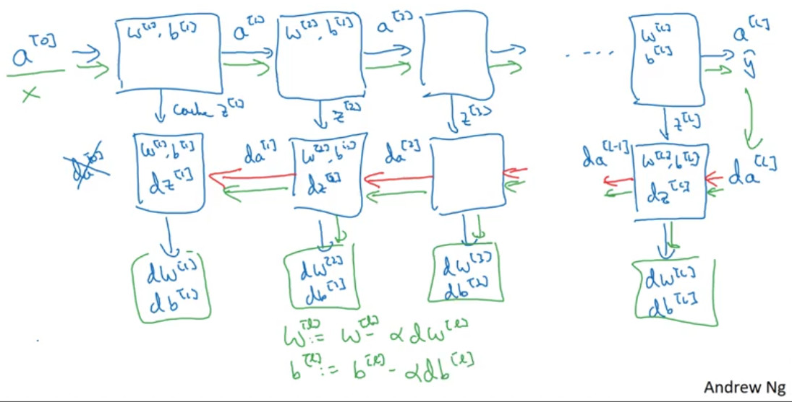

## Deep L-layer neural network

deep neural network가 무엇인지는 위의 그림을 통해 설명할 수 있다. 좌측 상단은 로지스틱 회귀를 신경망으로 표현한 것이고, 이외는 레이어의 수에 따라 신경망을 대략적으로 묘사한 것이다. 로지스틱 회귀는 shallow한 모델이며 반면 우측 하단의 5 layer 모델은 deep한 모델이라고 표현된다. 즉, hidden layer의 개수에 따라서 depth가 결정되는 것일 뿐이다.

## Forward Propagation in a Deep Network
deep neural network에서 forward propagation은 shallow neural network에서의 propagation과 매우 유사하다.
다음의 신경망을 통해 $\hat{y}$를 구하는 과정을 알아보자.

가장 먼저 $z^{[1]} = w^{[1]}x + b^{[1]}$를 구하고, 이를 활성함수에 적용하여 $a^{[1]}$를 구한다.
다음은 이 출력값 $a^{[1]}$를 두 번째 레이어의 입력값으로 이용한다. 즉,
$$ z^{[2]} = w^{[2]} * a^{[1]} + b^{[2]}\\
a^{[2]} = \sigma{(z^{[2]})}\\
z^{[3]} = w^{[3]} * a^{[2]} + b^{[3]}\\
a^{[3]} = \sigma{(z^{[3]})}\\
z^{[4]} = w^{[4]} * a^{[3]} + b^{[4]}\\
a^{[4]} = \sigma{(z^{[4]})} = \hat{y}\\
$$
를 통해 $\hat{y}$를 최종적으로 계산할 수 있다.

## Getting your matrix dimensions right
한편 week 3에서 shallow neural network를 구현할 때 행렬을 이용하였는데, 그 이유는 반복문을 사용하는 것보다 연산 속도가 빠르기 때문이라고 말한다. 행렬을 이용할 때에는 각 행렬의 차원을 올바르게 정의하지 않으면 에러가 발생하기 때문에, 차원을 잘 정의해 주어야 한다.
상세한 설명은 강의를 들으면 곧바로 이해할 수 있기 때문에 생략하고, 여기에서는 결론적으로 각 행렬의 차원이 어떻게 구성되는지만을 요약한다.

여기에서 m은 training data의 size를 의미한다.
|||
-|-|
|$a^{[l]}$,$z^{[l]}$|$(n^{[l]}, 1)$|
|$A^{[l]}$,$Z^{[l]}$|$(n^{[l]}, m)$ 만약 $l=0$이면 $A^{[0]} = X$ |
|$dA^{[l]}$,$dZ^{[l]}$|$(n^{[l]}, m)$ |

## Why deep representations?

이미지 인식에서 deep neural network는 각 레이어마다 학습할 특징을 나누어 학습함으로써 성능을 높일 수 있다. 위의 예시에서 첫 번째 hidden layer는 이미지의 모서리를 탐색하고, 다음 레이어에서는 모서리를 취합하여 얼굴의 부분부분을 감지한다. 다음으로 이 부위들을 합쳐서 여러 유형의 얼굴을 인식할 수 있게 된다.

다른 예시로는 circuit theory를 들 수 있다. shallow neural network로 함수를 계산하려고 하면, 하나의 레이어에서 더 많은 hidden unit이 필요하게 된다는 것인데, 다음의 예시를 통해 직관적으로 이해할 수 있다.

위의 예시는 x1 XOR x2 XOR x3 XOR .. XOR xn 연산을 수행하는 네트워크를 depth를 달리해 표현한 것이다. 좌측 네트워크의 경우 필요한 전체 hidden unit의 수가 $O{(\log {n})}$개이다. 반면 우측의 경우 $O{(2^n)}$개의 unit이 필요하다.

## Building blocks of deep neural networks

deep neural network의 학습은 위와 같은 과정으로 이루어지게 된다. 우선 $a^{[0]}$에서부터 forward propagation을 통해 $a^{[l]}$까지 계산한다. 그런 다음 backward propagation을 각각의 레이어에 적용하여 $dz^{[1]}$까지 계산한다면, 각 레이어마다 W와 b를 미분한 값이 산출된다. 이를 이용하여 parameter를 업데이트한다.$$W := W - \alpha * dW \\ b := b - \alpha * db$$

## Parameters vs. Hyperparameters
지금까지 다룬 예시에서 parameter는 W와 b이다. 한편 학습 알고리즘에 필요한 parameter가 존재하는데, 이들을 hyperparameter라고 부른다. hyperparameter에는 다음과 같은 것들이 있다.

- learning rate $\alpha$
- number of iterations
- number of hidden unit for each layer
- type of activation function
- momentum term, minibatch size, regularizations
- etc...

이들 역시 과거에는 parameter라고 불렸으나, 이들은 최종적으로 W와 b 값의 변화를 제어하는 역할을 하므로, 이들을 hyperparameter라는 이름으로 부르게 되었다.

이렇듯 딥러닝에는 여러 hyper parameter가 존재한다. 하지만 실제로 모델을 돌리기 전에 어떤 값이 가장 적절한지 알기란 쉽지 않다. 따라서 직접 hyper parameter를 바꿔가며 어떤 값이 가장 적절한지 알아보아야 한다.
