## Mini-batch gradient descent
mini-batch는 training set을 일정한 사이즈로 나누어 각각 학습시키는 알고리즘이다. 예를 들어 전체 데이터 크기가 500만개가 있을 때, 이들을 천 개 단위로 나누어 mini-batch를 만들 수 있다.
이렇게 만들어진 mini-batch $X^{\{T\}}$,$Y^{\{T\}}$( T = 1 ~ 5000) 에 대해 같은 방식으로 학습을 진행한다.

## Understanding mini-batch gradient descent
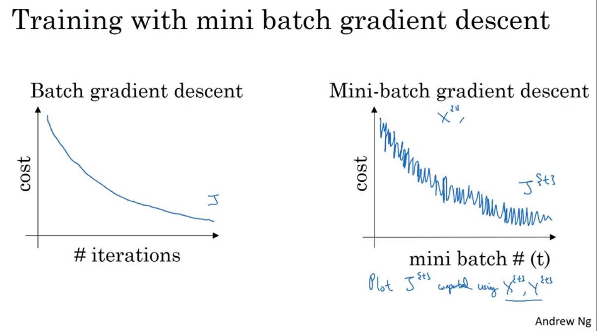

위의 그림은 batch와 mini-batch의 cost가 감소하는 모습을 표현한 것이다. 아래의 그림은 등고선을 통해서 어떻게 batch와 mini-batch가 최솟값을 탐색하는지를 나타낸 그림이다.

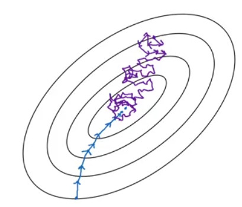

파란색 선은 batch, 보라색 선이 mini-batch일 때의 상황을 나타낸다. 그림만 보았을 때에는 파란색 선이 보다 효율적인 것처럼 보이지만 batch의 경우 컴퓨터 메모리를 많이 잡아먹고, 또한 local minimum에 빠질 위험이 있다. 반면 mini-batch는 데이터 사이즈를 나눔으로써 이를 방지해준다.

mini-batch에서 고려해야 할 하이퍼 파라미터로 mini-batch size가 있다. 이 값이 전체 데이터의 크기 m에 가까울수록 batch gradient dscent와 유사해지며 학습이 느려진다. 반면 1인 경우를 stochastic gradient descent라고 부르는데, 이 경우 vectorization의 이점이 사라지게 된다.

따라서 둘의 중간값을 선택하는 것이 좋다. 첫째로 vectorization의 이점을 살릴 수 있고, 둘째로 전체 training set을 이용하지 않고도 모델의 발전 과정을 관측할 수 있다.
그렇다면 적절한 중간값을 어떻게 선택할 수 있을까?

우선 training set이 크지 않다면 batch gradent descent를 사용하는 것이 좋다. 만약 데이터의 크기가 2000보다 좀 더 큰 경우 64나 128, 256, 512개의 mini-batch를 두는 것이 좋다.
또 다른 방법은 mini-batch가 CPU나 GPU 메모리 내에 들어갈 수 있는 용량으로 축소하는 것이다.

## Exponentially weighted averages
Exponentially weighted averages 혹은 Exponentially moving averages는 평균을 계산하는 데 있어서 최근 데이터에 더 많은 가중치를 부여하는 방법이다. 날씨 데이터와 같은 시계열 데이터에 적용할 수 있으며, 가중치를 지수적으로 부여하므로 Exponential이라는 이름이 붙게 되었다.

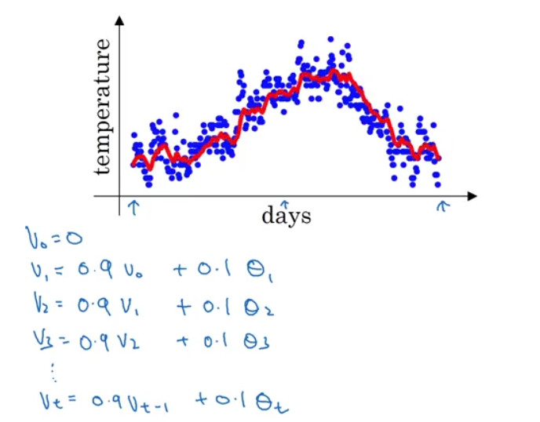

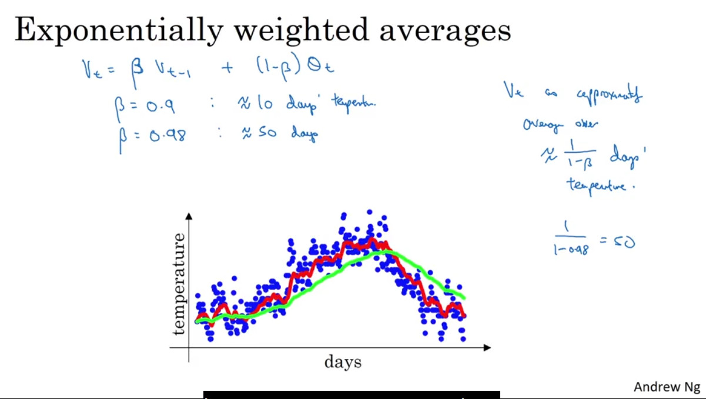

(* $\theta$ 는 각 날의 기온을 의미한다.)

위의 두 강의자료에서 볼 수 있듯 $\beta$ 값을 어떻게 두느냐에 따라서 어느 정도 과거의 데이터를 반영할 것인지를 결정할 수 있다.
베타 값이 클수록 과거 데이터의 반영 비율이 높아진다(위 그래프의 연두색 선)
$\beta$는 일반적으로 0.9나 0.98을 많이 사용한다. 0.9는 과거 10일 정도의 데이터, 0.98은 과거 50일 정도의 데이터를 반영한다고 한다.

## Understanding exponentially weighted averages

위의 예제를 일반화하면 exponentially weighted average의 식은 다음과 같이 정리할 수 있다.$$ v_{t} = \beta\,v_{t-1} + (1-\beta)\,\theta_{t} $$
따라서 $v_{t-1} = \beta\,v_{t-2} + (1-\beta)\,\theta_{t-1}$, $v_{t-2} = \beta\,v_{t-3} + (1-\beta)\,\theta_{t-2}$, ... 이렇게 전개되므로 다시 정리하면,

$$ \begin{matrix} v_{t} &=& \beta\,v_{t-1} + (1-\beta)\,\theta_{t}  \\
&=& \beta\,(\beta\,v_{t-2} + (1-\beta)\theta_{t-1}) + (1-\beta)\,\theta_{t} \\
&=& \beta^2v_{t-2} + \beta(1-\beta)\theta_{t-1}+ (1-\beta)\,\theta_{t} \\
&=&...\\
&=& \beta^{n-1}(1-\beta)\theta_{1} + \beta^{n-2}(1-\beta)\theta_{2}+ \beta^{n-3}(1-\beta)\theta_{3}+ ... +(1-\beta)\theta_{t}\end{matrix}$$

이렇게 정리된다. 가중치 $\beta$ 가 각 데이터에 대해 지수적으로 곱해지는 것을 확인할 수 있으며, $\beta$가 작은 값일 수록 이전 데이터들이 평균에 미치는 영향이 기하급수적으로 작아질 것을 짐작할 수 있다.

## Bias correction in exponentially weighted averages

exponentially weighted averages는 맨 처음에 할 때는 bias가 크기 때문에 얘를 보정해주어야 한다.

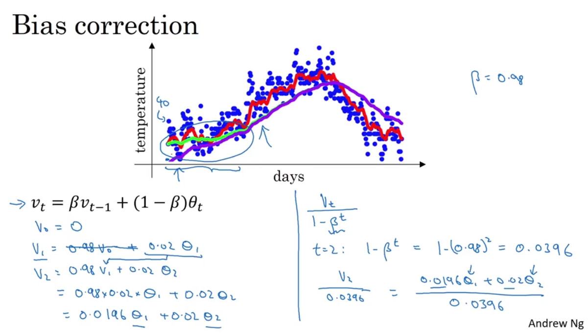

## Gradient descent with momentum

momentum 알고리즘은 일반적인 gradient descent 알고리즘보다 빠른 학습이 가능한 알고리즘이다. 앞서 배웠던 exponentially moving averages를 gradient에 적용하여 학습시키는 방법이라고 할 수 있다.
이전의 mini-batch에서 이전의 gradient와 지금의 gradient가 서로 달라져서 튀는 경우가 있는데, 이걸 방지해줌.

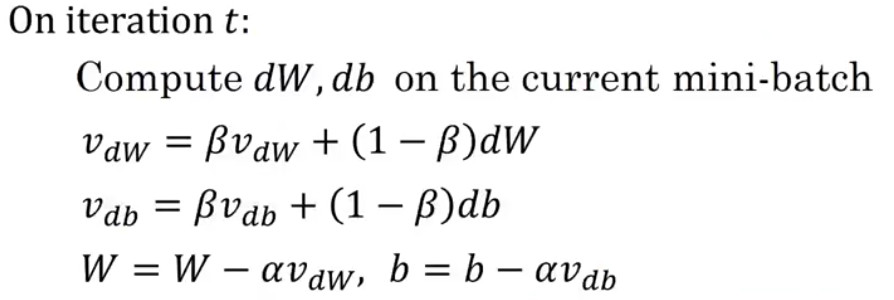

역전파 알고리즘을 적용할 때 위와 같이 dw와 db를 이용하지 않고 가중평균을 낸 $v_{dW}, v_{db}$ 를 이용하여 가중치를 업데이트함으로써 실제로 구현할 수 있다.

위의 그래프의 파란색 선은 일반적인 gradient descent를 적용한 것이고 빨간색 선은 momentum을 적용한 것이다. 빨간색 선이 보다 빠르게 최저의 cost function으로 수렴하는 것을 볼 수 있다.

## RMSprop

RMSprop, 또는 Root Mean Squared Prop은 momentum 과 마찬가지로 gradient descent의 학습 속도를 높여주는 알고리즘이다.

momentum과 유사하게 위의 그래프의 빨간색 선처럼 학습이 이루어질 수 있도록 gradient descent의 수식을 약간 조절하는 방식으로 이루어진다.
일반적인 gradient descent 에서 가중치가 learning rate * dw 만큼 업데이트됐다면, RMSprp은 다음의 식을 이용한다
$$ S_{dw} = \beta\,S_{dW} + (1-\beta)dW^{2} \\ S_{db} = \beta\,S_{db} + (1-\beta)db^{2} \\ W := W - \alpha\frac{dw}{\sqrt{S_{dW}}} \\ b := b - \alpha\frac{db}{\sqrt{S_{db}}}$$

위의 그래프에서 가로축이 W, 세로축이 b라고 가정하면, b의 학습 속도는 느려지고, W의 학습 속도는 빨라져야 빨간색 선처럼 학습이 이루어지게 될 것이다. 즉 위의 그래프에서 $S_{dW}$와 $S_{db}$는 dW와 db의 크기에 따라 업데이트의 속도를 조절하는 역할을 수행한다.

## Adam optimization algorithm

Adam(ADAptive Moment estimation) optimization algorithm은 앞서 배운 momentum과 RMSprop을 혼합(?)한 알고리즘이다.  그리고 momentum과 RMSprop이 batch gradient descent에도 적용 가능했던 것과는 달리 adam은 일반적으로 mini-batch에 적용된다. 알고리즘은 다음과 같다.

$V_{dW}=0, V_{db}, S_{dw} = 0, S_{db} = 0$ 로 우선 V와 S를 초기화한다. 그런 다음 반복 시마다 다음과 같은 방식으로 파라미터를 업데이트한다.

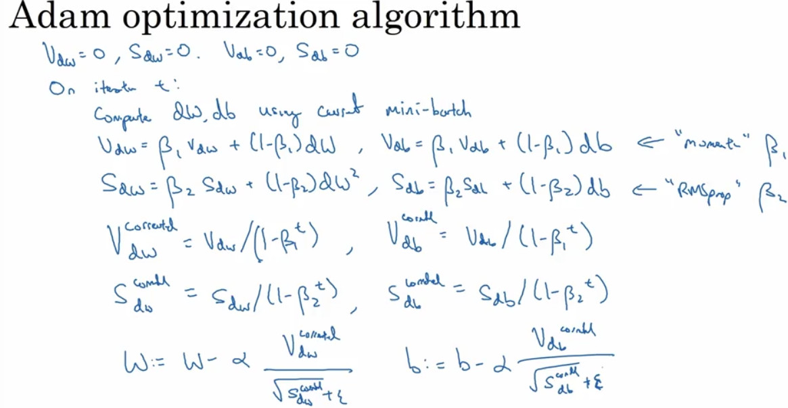

이 알고리즘에는 여러 하이퍼 파라미터가 존재하는데, 일반적으로 다음의 값을 이용한다.

## Learning rate decay

학습 속도를 높이는 다른 방법으로는 learning rate $\alpha$를 점진적으로 감소시키는 learning rate decay가 있다.

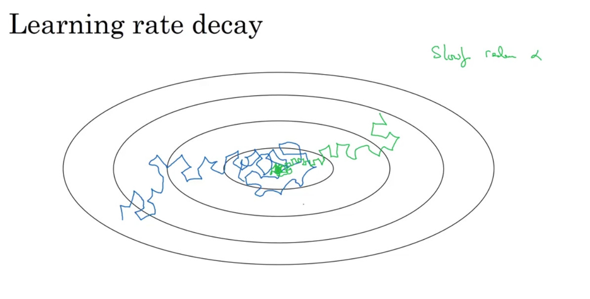

위의 파란색 선은 동일한 learning rate를 이용한 경우, 초록색 선은 learning rate를 점차 줄여나갔을 때의 변화를 보여준다. 파란색 선의 경우 수렴하지 못하고 최저점을 빙글빙글 맴돌게 되는데, 이는 learning rate가 수렴하기에 충분히 작지 않기 때문이다.
반면 초록색 선은 처음에는 큰 learning rate를 이용하여 빠르게 학습하다가, 최저점에 가까워질수록 learning rate가 감소하여 수렴하게 된다.

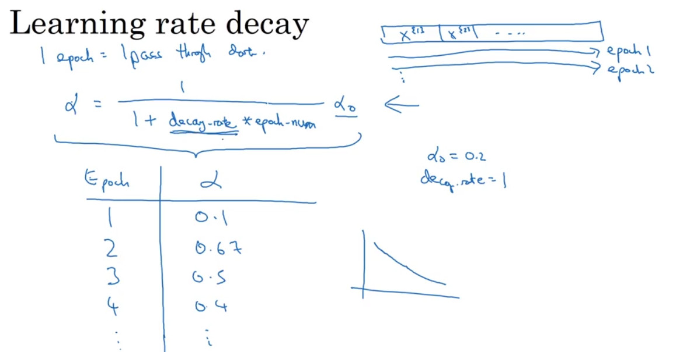

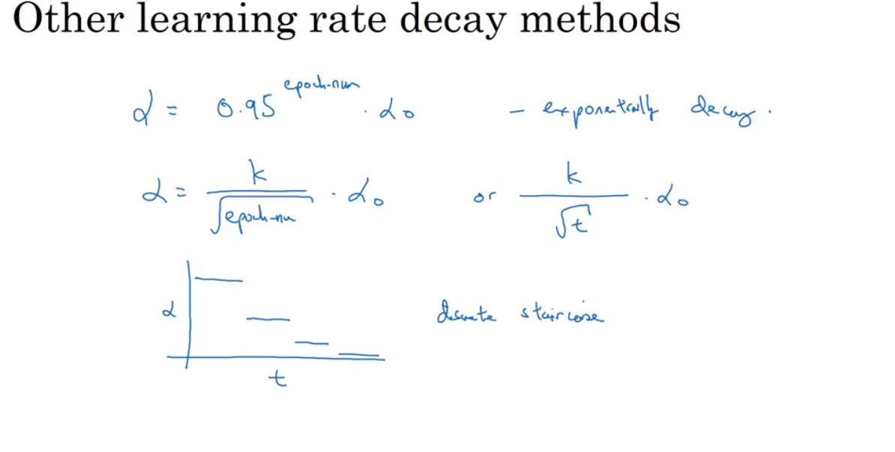

manual decay

## The problem of local optima

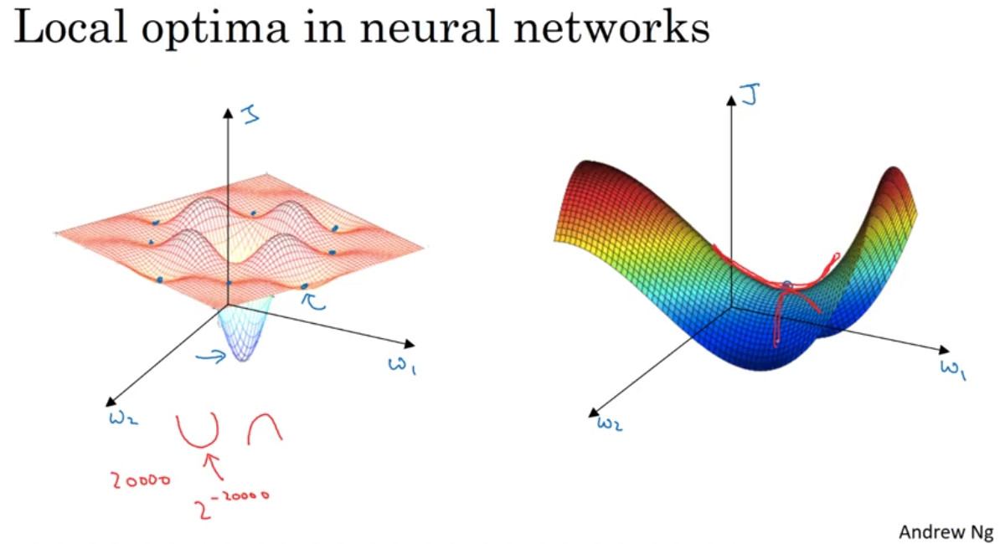

좌측의 그래프는 local optima의 개념에 대해 배울 때 자주 이용되는 그래프이다. 두 개의 파라미터 w1과 w2를 탐색할 때 위와 같이 기울기가 0이 되는 지점이 여러 곳이 존재할 수 있다는 것이 바로 local optima의 개념이다.
하지만 신경망에서 의외로 local optima 문제는 잘 발생하지 않는다고 한다. 신경망에서는 더 많은 feature를 사용하기 때문이다. 2만 개의 feature를 학습에 이용하는 경우, local optima가 발생할 확률은 매우 적어질 것이다.
반면 우측의 그래프와 같이 안장점(saddle point) 문제가 발생할 수 있다. w1의 입장에서는 최저점이지만 w2의 입장에서는 그렇지 않은 것이다.

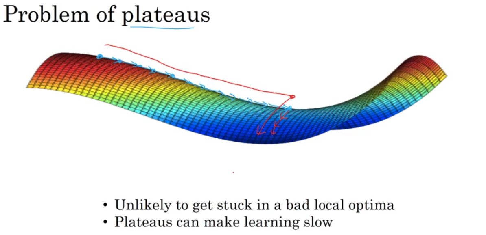

그렇다면 구체적으로 이는 어떤 문제를 야기하게 될까? 위의 이미지는 안장점에서 발생할 수 있는 문제를 보여준다. 이 문제를 plateaus 문제라고 하는데, plateaus란 기울기가 0에 매우 가까운 지점, 혹은 0인 지점을 의미하는 단어이다. 이는 신경망의 학습을 느리게 만든다.
따라서 위에서 배운 adam 등의 방법을 적용하여 이 문제를 해결할 수 있다.
