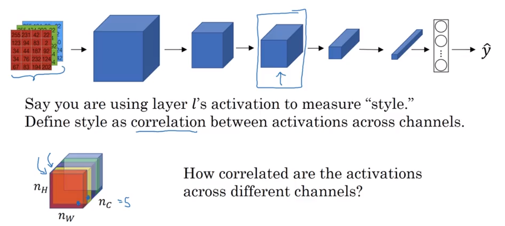
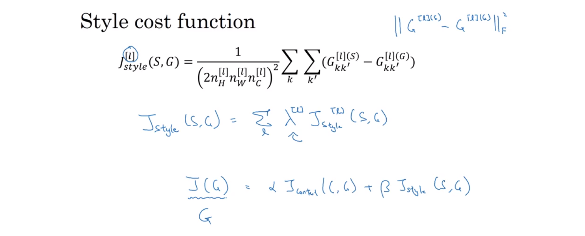
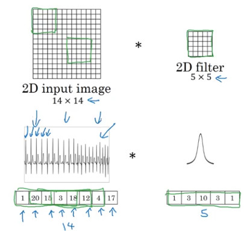

## Style Cost Function   

- Style Cost Function은 Content Cost Function과 다른 방식
- 하지만 Content Cost Function과 마찬가지로 pre-trained된 모델을 사용
- 핵심 개념은 "Style을 activation에서 channel별로 Correlation으로 정의 하는 것" 
 

----
- CNN에서 각 layer의 output(activation)은 input을 여러 channel로 convolution한 image들의 집합
- 아래 사진에서 activation의 빨강, 노랑, 파랑 등의 부분은 input을 다른 channel로 convolution한 것 결과. 즉, 각각 input에서 뽑아낸 특징
  
  

  
- 아래 사진에서 activation의 빨강 부분은 input image에서 세로 선들을 뽑아낸 것, 노랑 부분은 빨간색, 주황색 계열을 뽑아낸 것
- activation의 빨강 부분, 노랑 부분 들의 correlation로 Style을 정의
- Style은 세로 선이 존재 할 때 붉은 계열도 존재하는지의 상관관계를 구하는 것 
- 모든 channel에 의한 activation들의  correlation로 Style을 정의  
- Style을 구하기 위해 사용하는 layer들은 pre-trained된 CNN 모델을 사용(ex) vgg  
 

----
- 아래 사진은 이를 수식으로 어떻게 나타내는지 보여준다.    
  
 
- correlation matrix인 "Gram matrix" (G라 부름)
- G의 size는 $l$ layer의 activation을 구할 때 사용된 channel의 수
- G의 (k,k')값은 activation k번째 channel로 conv한 것과 k'로 한 것에서 같은 위치(nh, nw)에 있는 값들을 곱해서 합한 것
- 결과적으로 우리가 원하는 것은 S(Style)와 G(Generated)의 "Gram matrix"차이를 줄이는 것
- Gram matrix 차이의 norm에 행렬의 크기에 관련된 숫자($beta$를 곱할 것이기 때문에 크게 중요하지 않음.)를 나눠주고 $beta$를 곱해주면 $l$번째 layer에서의 Style loss function. 
 
----
  

 

- 모든 Layer에 대해서 Style Loss Function을 더하면 Style Cost Function    

 
## Content Cost Function
- style transfer의 경우 비용 함수 두 개를 사용함
  - content cost Function
  - style cost function

- content cost function을 정의하는 법
  - content cost를 계산하기 위해서 은닉층 중 하나를 선택
    - 보통 은닉층 중간 정도에 있는 레이어를 선택함
  - 미리 학습된 네트워크를 선택
  - $a^{[1](C)}$와 $a^{[1](G)}$를 각각 원본과 생성된 이미지 대한 activation라고 할 때, 두 값이 유사하다면 두 이미지가 유사한 내용을 가지고 있다고 할 수 있음
  - $J_{content}(C, G) = \alpha * ||a^{[1](C)} - a^{[1](G)}||^{2}$로 정의   
  
   
## Style cost function  
- Image Style  
한 레이어 안에서 다른 채널들의 활성 사이의 상관 관계로 스타일을 정의. 
한 레이어의 활성 블록을 nh x nw x nc라 할때, 
모든 nh x nw 위치에서의 Style을 표현   
 
  

- Intuition about style of an image  
아래 사진에서 빨간 채널이 수직선이 많은 신경에 대응하고 노란 채널이 주황색이 특징적인 신경에 대응한다고 하면,   
두 채널이 강한 상관 관계가 있다는 것은 이미지의 해당 부분이 미세한 수직 텍스처 유형을 가지고 있으면, 주황빛 계열을 가지게 된다는 뜻.    
그렇다면 상관 관계가 없다는 것은 수직선이 있더라도 주황빛 계열이 아닐 수도 있다는 의미.   
상관관계는 생성된 이미지 상에서 얼마나 자주 이런 유형의 수직 텍스처가 주황빛과 같이 발생하거나 발생하지 않는지에 대한 측정 방법,    
즉, 생성된 스타일이 인풋 스타일 이미지와는 얼마나 비슷한지에 대한 측정치.   
 
      
 

- Style Matix
 
  
 
 - 레이어 l, 높이 i, 너비 j, 채널 k(1,...,nc)
 - G(Gram matrix 또는 Style matix)는 nc x nc 차원의 제곱 매트릭스
 - G는 채널 k에서의 활성화와 채널 k'에서의 활성화가 얼마나 상관 관계가 있는지를 측정
 - 이미지의 서로 다른 위치에서 높이와 너비에 대한 합이고, 채널 k와 k프라임 의 액티베이션을 곱하는 것  
 - Style image(S)와 Generated image(G)에 대해 각각 Style Matix 생성.    
 - Style cost function은 Style Image(S) 와 Generated Image(G)사이의 레이어 l 에서 두 Style matrix의 차의 제곱의 전체 합(Frobenius Norm) 
       
      
- Style cost function    
 
  
 
 - 전체 Style cost function은 λ^[l]x(추가적 가중치를 둔 Style cost)의 합 
 - 전체 Cost function은 αx(C, G의 전체 cost) + βx(S, G의 전체 style cost)

  
## 1D and 3D Generalizations

- 1차원 데이터에 convolution을 적용하는 방법
 
  
 
  - ex) 각 시간 단위마다의 심장의 전압?을 측정하는 심전도
  - 2D convolution의 경우
    - 14 * 14 * 3 데이터에 대해 5 * 5 * 3필터 적용 : 10 * 10 convolution
  - 1D의 경우
    - 14 * 1 데이터에 대해 5 * 1 필터 적용 : 10 convolution
    - 2D와 동일한 방식으로 실행하여 결과를 얻을 수 있음
    - 이런 시계열 데이터와 같은 경우에는 RNN을 사용할 수도 있으며 각각을 사용할 때의 장단점이 존재
      - RNN 파트에서...

- 3차원 데이터에 적용하는 방법
  - ex) CT 스캔(신체의 각 단면을 촬영한 사진이지만 각각의 사진을 하나의 input으로 이용함)
 
  -   
   
  - 이 경우 필터가 3차원으로 변경됨
