
# course 4. Convolutional Neural Networks
## week 1. Foundations of Convolutional Neural Networks  

###  4.1.1. Computer Vision
* : Image Classification, Object Detection, Neural Style Transfer 
* 이미지 데이터의 RGB
	- 64x64 pixel의 경우 64x64x3 = 12288 의 크기를 갖는 입력값
	- 이미지 크기가 크면 parameter의 수가 많아져 과적합의 문제와 계산 및 메모리 부적합의 문제 발생 
	(1000 x 1000 pixel과 같은 고해상도 이미지의 경우,  standard fully connected network를 사용한다면 첫번째 은닉층에서 30억 개 정도의 parameter)
	- 합성곱 신경망(Convolutional Neural Networks, CNN)의 연산이 이미지 크기에 대한 고민을 해결. 

### 4.1.2. Edge Detection Example

  

 - 합성곱 연산은 합성곱 신경망(CNN)의 핵심 요소
 - 합성곱 연산의 방식: 필터(또는 커널) 행렬을 이미지의 왼쪽위에서부터 시작하여 오른쪽과 밑으로 옮겨가며 대응 요소끼리 곱한 것을 모두 더해주는 방식. 

 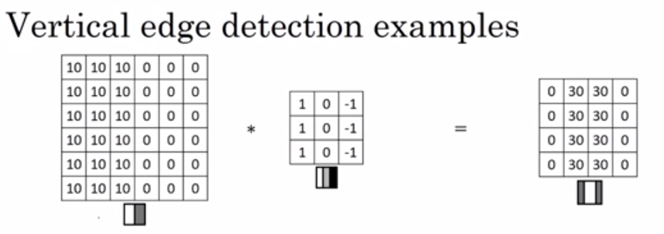  

 

 

      

 *합성곱 연산 방식*   

 위 예시에서 6 X 6 pixel의 Grayscale 이미지가 있다고 하면, 별도의 RGB 채널이 없기 때문에 6 x 6 x 3 의 행렬이 아닌 6 x 6 x 1 의 행렬이 된다. 아래 예시에서는 3x3 크기의 행렬에 1 1 1 0 0 0 -1 -1 -1의 값을 차례로 넣은 필터를 사용했다.
  왼쪽의 행렬이 감지할 이미지이고, 가운데 있는 행렬이 필터, 그리고 오른쪽 이미지가 결과 이미지가 된다. 결과 이미지의 가운데 밝은 영역이 감지 대상 이미지의 가운데에 강한 경계선이 있다는 것을 알려준다.  
  
### 4.1.3.  More Edge Detection
  * 밝기 전환  
 
 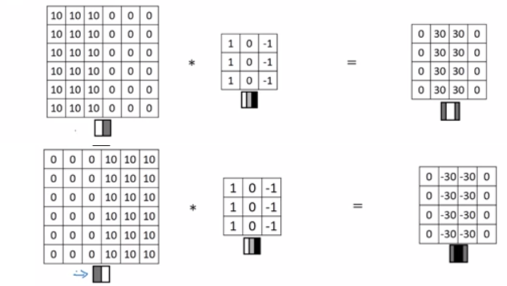      
 
*밝기 전환*
 
 이미지를 뒤집어서 왼쪽이 어둡고 오른쪽이 밝을때 동일한 필터로 합성곱을 하면, 결과 이미지에서 30 대신 -30 의 값을 얻는다. 따라서 양과 음의 윤곽선의 차이 즉, 서로 다른 밝기의 전환을 확인할 수 있다. 두 종류의 차이가 중요하지 않다면, 결과 행렬에 절대값을 씌워줄 수 있다. 

- 합성곱 필터의 종류 

 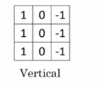  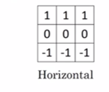      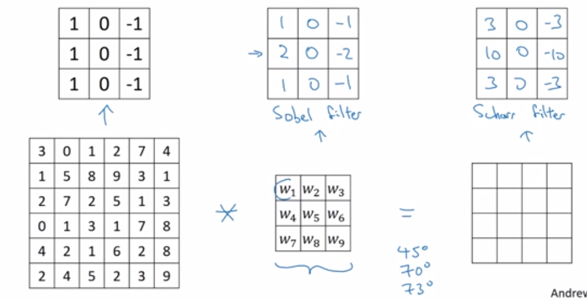     

 *합성곱 필터의 종류* 

 CNN에서는 합성곱 필터 행렬의 값들이 parameter가 된다. 필터 행렬의 숫자 요소들을 변수로 두고 데이터로부터 학습함으로써 신경망이 이미지 내에서 윤곽선같은 하위 단계의 속성을 학습할 수 있게 된다.   
 
 - 딥러닝 프레임워크의 합성곱 연산 함수
   -  Tensorflow: tf.nn.conv2d
   -  Keras: Conv2d

### 4.1.4. Padding

- 합성곱 연산에서 이미지 축소의 문제점 
	- 수백 개의 층을 거쳐 아주 작은 이미지만 남게 될 수 있다. 
	- 이미지 가장자리의 정보들을 버린다.    
	
* Padding 
이미지 축소의 문제점을 해결하기 위해 이미지를 덧대어 입력값으로 넣어주는 변형 방식. 

   

   

   

 *Padding*   

위 예시에서는 1 픽셀만큼 가장자리에 더해주었다. 그렇게 되면 기존의 6 x 6 이미지가 아닌 8 x 8 이미지가 되어 3 x 3 필터와 합성곱을 하면 6 x 6 이미지를 얻게 된다. 이 결과, 이미지는 기존의 크기와 동일한 효과를 갖는다. 또한, 가장자리의 정보를 모두 취할 순 없지만 버리는 양을 줄이게 된다. 

 -  패딩의 양 선택
	- Vaild convolution(유효 합성곱): 패딩이 없는 경우. 
	n x n 이미지, f x f 필터일 경우, 결과 이미지 (n - f + 1) x (n - f + 1) 
	- Same convolution(동일 합성곱): 패딩이 있는 경우. 입출력 이미지 크기가 동일.
	n x n 이미지, f x f 필터, p=패딩의 양일 경우, 결과 이미지 크기 = (n + 2p - f + 1) x (n + 2p - f + 1)  
	n = (n + 2p - f + 1) 
	p = (f - 1) / 2
	- 일반적으로 필터 크기 f x f 에서  f 는 3, 5, 7과 같은 홀수이다. f가 짝수이면 패딩이 비대칭이 되고, 홀수의 경우에는 중심 위치가 존재하기 때문에 필터의 위치 파악이 용이하다.  

### 4.1.5. Strided Convolutions
- Stride
	합성곱 필터 적용시 stride 값의 간격을 두어 칸을 옮기며 연산하는 것.
	
 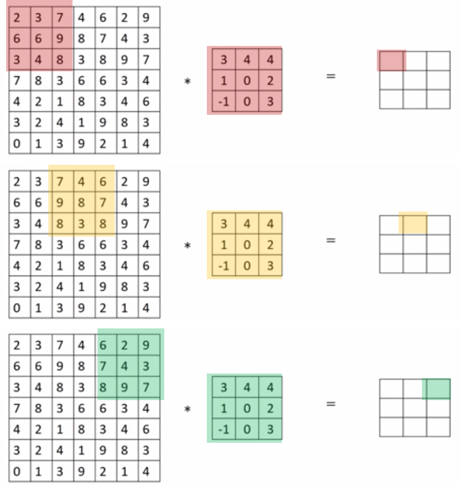  
	
 *Stride*   
- 합성곱 결과 요약
	
 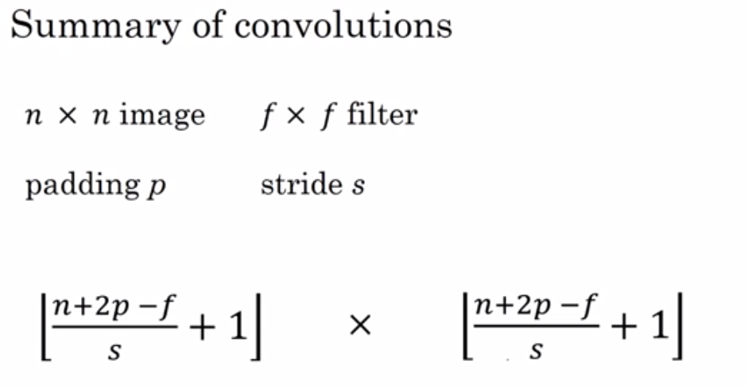    
	
 *convolutions*    
	
  분수값이 정수가 아닐 경우 내림 연산하여 필터가 밖으로 나온 경우 계산에 포함하지 않는다. 일반적으로는 필터가 패딩된 이미지에 맞도록 설정한다. 
- Cross correlation과 Convolution
	일반적인 수학 교재에서 정의하는 Convolution은 가로축과 세로축으로 뒤집어 주는 mirroring 단계가 있다.  딥러닝 분야에서는 유용하지 않으므로 미러링 과정을 생략하여 코드를 단순화한다. 이것을 Cross correlation라고 해야 하지만, 관습적으로 Convolution이라 부른다. 
	
 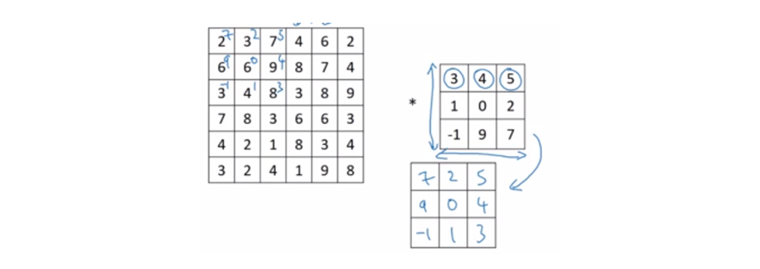
	
 *mirroring*        

### 4.1.6. Convolutions Over Volume

* RGB 이미지 3D 필터
	* 너비x 높이x 채널의 수
	* 이미지의 채널 수와 필터의 채널 수가 일치

  
 
* RGB 필터
	  - 빨간색의 윤곽선을 감지하는 필터       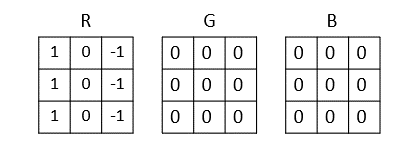   
	  - 특정색과 상관 없이 감지하는 필터      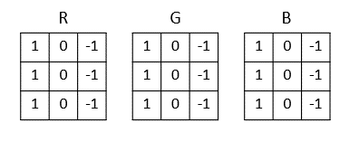  
	  
* 다중 필터
	 - 세로와 가로, 또는 45도 혹은 70도 기울어진 윤곽선을 모두 감지 
	 - 검출하고자 하는 특성의 수 = 필터의 채널 수

 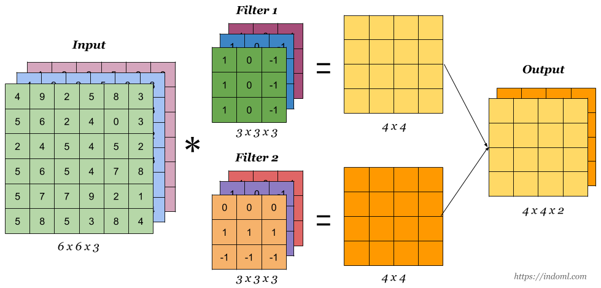

### 4.1.7. One Layer of a Convolutional Network

* 합성곱의 단일 층
 
 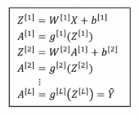
 
 *Forward Propagation*  

 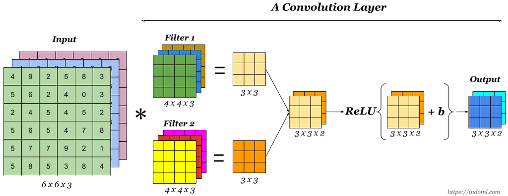  

 *One convolutional Layer*  
  

 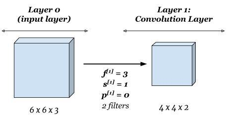

 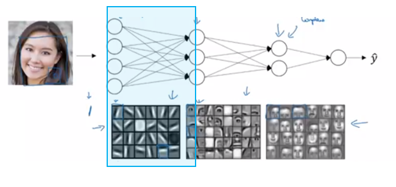

* notation 

 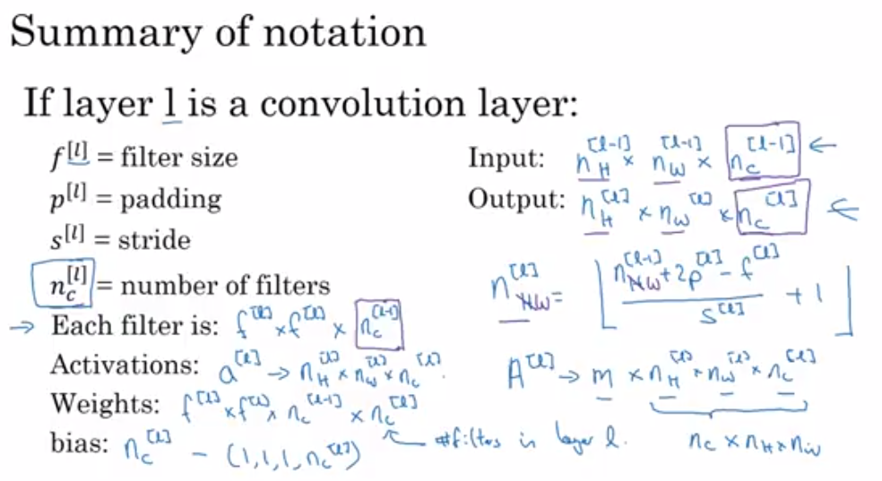

### 4.1.8. Simple Convolutional Network Example
- CovnNet Example

 
	- 신경망 깊이가 깊어질 수록 입력값의 높이와 너비가 줄어들고, 채널의 수는 늘어나는 경향 
- types of layer in CNN
	-Convolution (CONV)
	-Pooling (POOL)
	-Fully Connected (FL) 
		
### 4.1.9. Pooling Layers
-  Pooling Layers: 표현 크기를 줄임으로써 계산 속도와 특성 검출의 정확도 증가  

 

 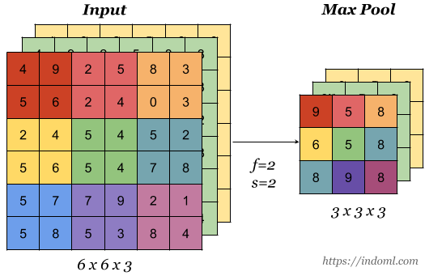  

- hyper-parameters
	-   filter size  (_f_) 
	-   stride  (_s_) 
	-   pooling type  (max or avg)    
-  hyper-parameter가 고정값이기 때문에 gradient descent로 학습 하지 않는다. 
- f = 2, s = 2: 높이와 너비를 절반으로 줄임

### 4.1.10. CNN Example

 
- 일반적으로 신경망의 층의 개수를 말할 때 가중치와 변수를 가지는 층을 말한다. Pooling layer는 가중치와 변수가 없고 하이퍼파라미터만 있기 때문에, CONV와 POOL을 하나의 층(Layer) 으로 묵는다.

 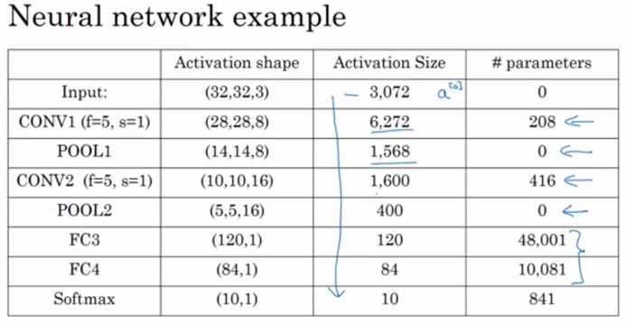

### 4.1.11. Why Convolutions?
-  Convolution의 장점
	-  Parameter sharing: 동일한 필터를 입력 이미지의 여러 위치에서 동일하게 사용함으로써 학습해야 할 parameter의 갯수가 적다.
	- Sparsity of Connection: 입출력이 필터의 크기만큼만 영향을 받아 parameter의 갯수 감소 

#### Additional Reference
https://indoml.com/2018/03/07/student-notes-convolutional-neural-networks-cnn-introduction/ 
