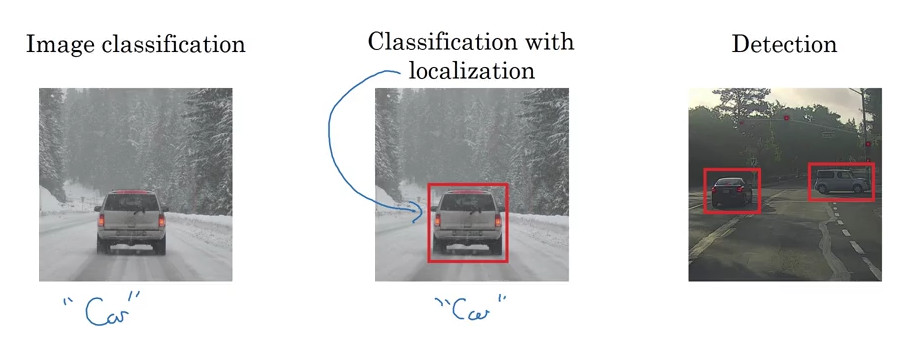
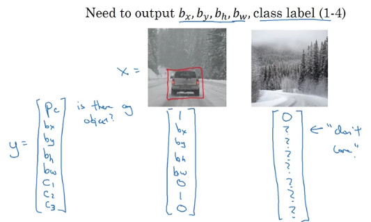
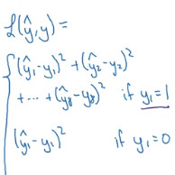
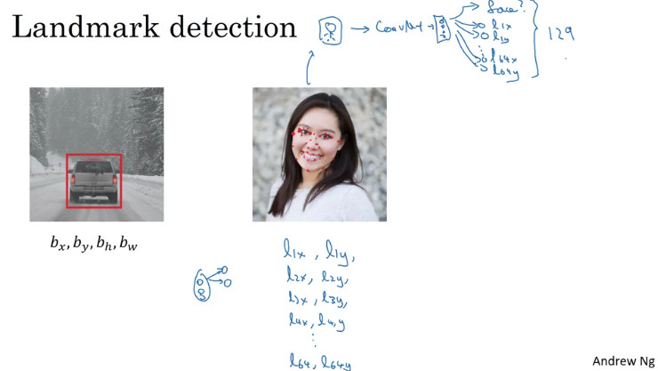
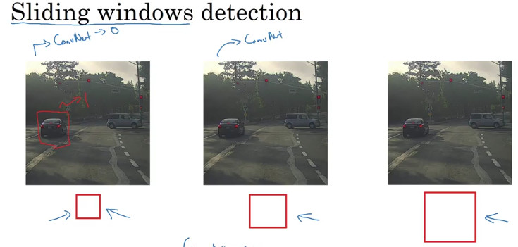
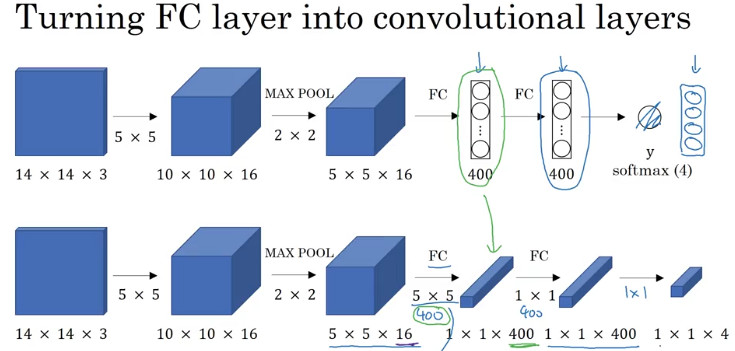
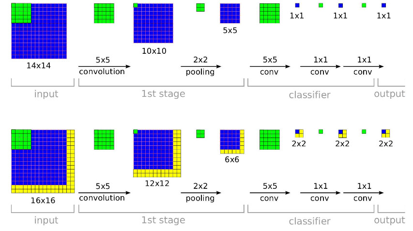
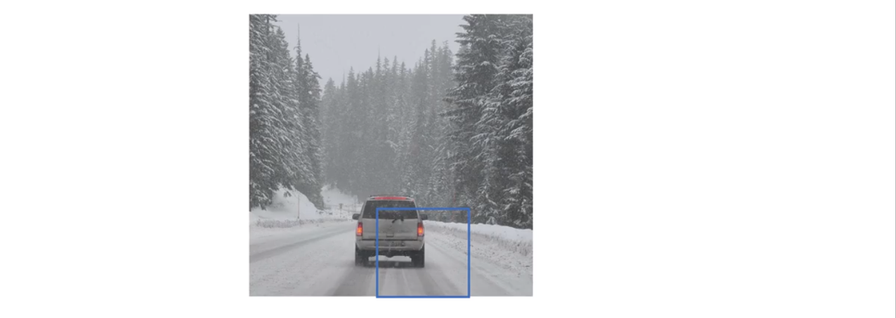
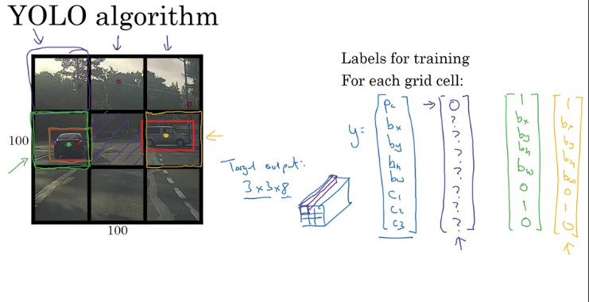
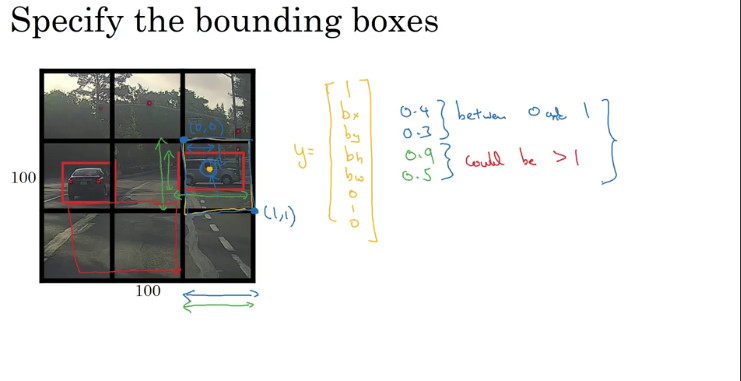

# course 4. Convolutional Neural Networks  

## week 3.Object detection (1)  

  

### 1. object Localization

-object localization의 분류
  - Image classification : 사진 속의 물체가 "어떤" 것인지를 분류
  - Classification with localization : 분류하는 것 뿐만 아니라 물체의 위치를 특정
  - Detection : 다중 클래스 분류 + 특정

- Classification with localization의 output
  - 이미지 분류를 위한 ConvNet은 동일
  - y = softmax(4 unit) +  localization(4 unit)

  - p_c : 물체가 있는지(1) 없는지(0)
  - b_x~b_w = 물체의 중심점과 너비, 높이
  - c_1~c_3 : 분류하고자 하는 물체를 one-hot encoding으로 표현한 것

- Loss function

  

### 2. landmark Detection

- Landmark : 물체의 특정 부분을 의미. ex) 사람의 얼굴에서 왼쪽 입꼬리, 보조개 등

- 학습 데이터의 구성 : 탐지하고자 하는 부분의 x, y 좌표를 지정
- convnet을 통해 각각을 분류하도록 학습시킴
- 위의 예제에서라면 총 129개의 output이 출력된다. 분류하고자 하는 물체인지 아닌지(1) + 각각의 랜드마크가 존재하는지 아닌지의 여부(128)

## 3. Object Detection

- 학습 데이터의 구성 : 정확히 탐지하고자 하는 물체만을 cropping한 이미지를 사용.  
    
- 테스트 데이터 : sliding window approach
  - 테스트 이미지의 일부분을 사각형(window) 영역으로 잘라서, 훈련시킨 합성곱 신경망에 입력하여 예측
    
   
  - 작은 크기의 window로 수행한 sliding이 끝날 때마다 커지는 window로 sliding 반복 
     - window의 크기와 stride의 크기에 따라서 계산 비용과 정확도의 trade off 가 발생함
     - 단점 : 계산 비용이 크고, 속도가 느리다.   
  

## 4. Convolutional Implementation of Sliding Windows

- fully-connected layer를 Convolution하게 구현하는 방법
     
  - fully-connected layer를 1x1 단면을 가진 convoluntional layer로 바꿔줌 (400은 임의)
    - fully connected layer와 수학적으로 완전히 동일한 연산
    - 장점
        1. sliding window에서 발생할 수 있는 computational cost를 축소할 수 있음(이유는 아래에)  
          : 독립적인 정방향 전파를 순차적으로 수행하는 것 대신, sliding 계산을 한 번에 동시에 통합하여 계산
        2. 계산량 줄이면서 비선형성 추가로 복잡성 증가
        3. 원하는 shape의 output
        4. FC에 비해 파라미터 감소 및 단순화
- sliding window 구현 방법(By. OverFeat논문)
     
  - 위가 train, 아래가 test 데이터
  - sliding window의 크기가 14일 때, 만약 convolution하게 구현하지 않는다면 총 4번의 예측을 시도해야 함
    - ex) 위의 이미지에서 sliding window의 크기가 14라고 가정하자. 그렇다면 16 X 16 픽셀의 테스트 데이터를 예측하기 위해서는 4개의 sliding window 필요할 것이다. 즉 네 번의 파이프라인을 돌리게 된다
    - 그러나 각각의 이미지에 대해서 pipeline을 돌리는 동안, 이미지 가운데의 픽셀은 4개의 window에 동일하게 이용되기 때문에 동일한 연산의 불필요한 중복이 발생.
    - convolution하게 sliding window를 구현한다면 연산 결과를 공유할 수 있다는 이점이 존재함
  - input data를 crop해서, 4개의 FC 레이어를 생성하는 것이 아니라, 2X2X4 convolution layer를 생성

## 5. Bounding Box Predictions

- sliding window의 단점 : bounding box가 물체에 애매하게 걸쳐질 수 있음  
     
- YOLO 알고리즘
  - 학습 데이터를 crop하지 않고 전체 이미지를 학습시킬 수 있음
  - 이미지를 일정한 크기의 그리드로 나눔(3 X 3, 19 x 19...)
   
  - 각 그리드마다 물체가 하나 존재하기 때문에 classification and localization의 방법론을 적용할 수 있음
    - 여러 개의 물체가 있는 경우는 추후 다룰 예정
  - 각 물체의 좌표 및 길이는 다음과 같이 인코딩
     
    - 그리드의 우측 상단의 상대적 좌표를 (0,0), 좌측 하단의 상대적 좌표를 (1,1) 로 설정
    - b_x와 b_y는 0~1사이의 좌표값을 가짐
    - b_h(높이)와 b_w(너비)는 그리드 하나의 높이와 너비를 1로 놓고 상대적인 길이를 측정
      - ex) 만약 bounding box의 너비가 전체 그리드 대비 90%를 차지한다면 b_w = 0.9
      - ex) 만약 bounding box의 너비가 전체 그리드 크기보다 크다면 b_w > 1 
