### 2.1.3 **Trade-Off** Between Prediction Accuracy(예측 정확도) & Model Interpretability(모델 해석력)

앞의 Years of Education과 Seniority를 통해 Income을 예측하는 두가지 예시 모델을 보자.

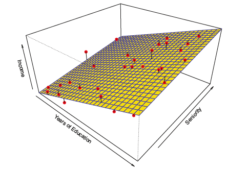

​                                                                                 *(그림 2.1)* 

​                                        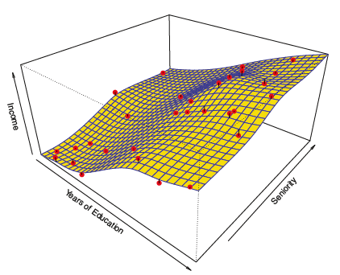 

​                                                                                 *(그림 2.2)*

(그림 2.2)의 Smooth thin-plate spline과 같은 방법들은 (그림 2.1)의 선형적 모델보다 훨씬 유연(flexible)하고, 보통의 경우 더 오차가 적은 예측을 보여준다.  

그럼 다음과 같은 의문이 생긴다. ***도대체 왜 매우 유연한 기법 대신에 더 제한적인(restrictive) 방법을 사용하는가?***

---

#### 모델의 유연성과 해석력에는 Trade - Off 관계가 있다!

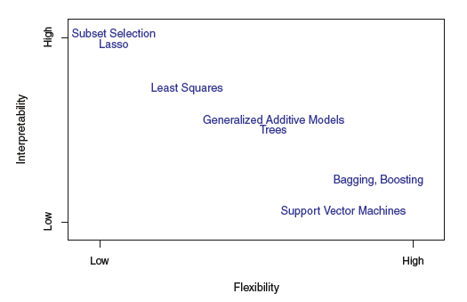

​                    (그림 2.3) 몇 가지 method들에 대해 flexibility와 interpretability의 **Trade-Off** 관계

**우리가 *f*를 추론하고자 하는 이유 : 예측(Prediction) vs 추론(Inference)**

> **추론이 목적인 경우**

- **해석이 중요**
- 따라서 *f*의 추정이 복잡하여 각 X와 Y의 상관관계를 이해하기 어려운 유연한 모델보다,
- X와 Y의 상관관계를 매우 직관적으로 해석할 수 있는 제한적 모델이 better!(e.g. 선형모델)

>**예측이 목적인 경우**

- e.g. 주가 예측 알고리즘
- 적용 가능한 가장 유연한 모델이 최선?
- Not Always the case! (Overfitting)

### 2.1.4 Supervised VS Unsupervised Learning

> **Supervised Learning(지도학습)**

- 설명변수 *x**i* (*i* = 1, ... , n) 에 대해 연관된 반응변수 *y**i*가 존재
- 목적 : 예측(Prediction) 또는 추론(Inference)
- Linear Regression, Logistic Regression, GAM, Boosting, Support vector machines

> **Unsupervised Learning(비지도학습)**

- 설명변수 *x**i* (*i* = 1, ... , n) 에 대해 연관된 반응변수 *y**i*가 존재하지 않음
- 목적 :  그룹을 식별하는 것
- Clustering Analysis

> **Semi-Supervised Learning(준지도학습)**

- *n*개 관측치의 집합이 있을때
- *m*(<*n*)개의 관측치는 설명변수에 대한 반응변수가 존재
- *m*-*n*개의 관측치는 설명변수에 대해 반응변수가 존재하지 않는 경우
- ISLR에서는 다루지 않음.

### 2.1.5 Regression VS Classification Problems

> **Regression Problem**

- 양적(*quantitative*) 반응변수(*y*)를 가지는 문제
- 양적 반응 변수란, 수치 값을 취하는 것 
- e.g. 사람의 나이, 키, 수입, 집 값, 주식 가격 등

> **Classification Problem**

- 질적(*qualitative, categorical*) 반응변수를 가지는 문제
- 질적 반응변수란, K개의 다른 클래스(혹은 카테고리) 중의 하나를 값으로 가지는 것.
- e.g. 사람의 성별(남 or 여), 성적(A,B,C,D or F), 채무 지불 여부(연체 or 완납) 

​       **이 구분이 항상 명확한 것은 아님**.

e.g. ) 

**Least sqares linear regression**(최소제곱선형회귀) : 양적 반응변수와 사용
**Logistic Regression**(로지스틱 회귀) : **질적 반응변수와 사용** but 클래스 확률(양적)을 추정하므로 회귀로 생각될 수도 있음

## 2.2 Assessing Model Accuracy(모델의 정확도 평가)

***왜 하나의 최고의 방법 대신 많은 통계학습 기법을 소개하는가?***

- 통계에서 모든 자료에 대해 어떤 한 방법이 다른 방법들보다 지배적으로 나은 경우 X
- 임의의 주어진 자료에 대해 그에 맞는 최고의 기법을 선택하는 것이 중요

### 2.2.1 Measuring the Quality of Fit

주어진 자료에 대한 통계학습방법의 성능을 평가하기 위해서는 **예측** vs **관측된 데이터** 비교가 필요

회귀 설정에서, 가장 일반적으로 사용되는 척도는 MSE이다.

여기서 ) 은 *i*번째 관측치의 예측값이다. 예측된 반응 값들이 실제 반응 값들과 가깝다면 MSE는 작아질 것.

**But...**

위의 MSE는 training data를 사용하여 계산되므로 엄밀하게는 *train MSE*이라고 할 수 있다.

우리가 관심있는 것이 *train MSE*일까?

e.g. 6개월 간의 주식 수익률을 바탕으로(training data) 주식 가격을 예측하는 알고리즘.

관심있는 것은, 과거가 아닌 **미래**이다!

#### training observation VS test observation

임의의 통계학습방법을 training observation {,(x_{1},y_{1}),...,(x_{n},y_{n}))} 에 적합하여 추정함수 를 얻었다고 해보자. 우리는 ,\hat{f}(x_{2}),...,\hat{f}(x_{n}))을 계산할 수 있고, 이 값이 와 거의 같다면, *train MSE*는 매우 작을 것이다. 하지만 우리는 앞에서 말했듯 기존 train data의 \approx y_{i})는 관심이 없다.

)를 통계학습방법을 훈련시키는데 사용되지 않은, 사전에 본적이 없는 **test observation**이라고 한다면 ***test MSE***는 다음과 같이 정의할 수 있다.

​                                                                   

우리는 결국 가장 낮은 *train MSE*가 아닌 **가장 낮은 *test MSE*를 제공하는 방법(모델)을 선택**하는 것이 목표이다. 

#### 그럼 어떻게 *test MSE*를 최소화 할까?

> ***test set* 이 있을 경우**

- 단순하게 *test MSE*를 최소화 하는 학습방법(모델)을 선택

> ***test set*이 없을 경우**

- *train MSE*를 최소로?
- 가장 낮은 *train MSE* --> 가장 낮은 *test MSE* ?  **보장이 없다!** 
- 문제는 많은 통계학습방법들이 *train MSE*를 최소가 되도록 계수를 추정...

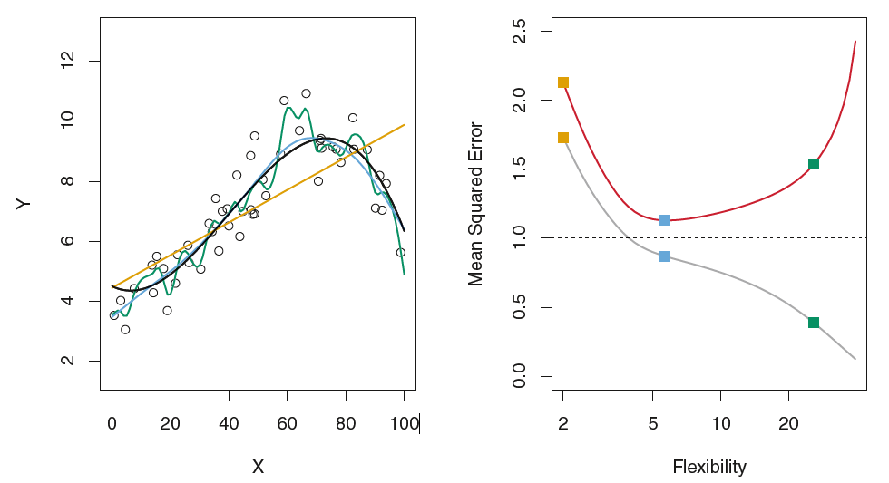

> **검정색 True *f*의 예**

- 노란색은 선형회귀 적합, 파란색&녹색은 Smoothing Splines(7장에서 다룸)
- 우측은 Flexibility(엄밀하게는 자유도)와 *train MSE*, *test MSE*의 그래프
- 점선은 irreducible error Var() --> *test MSE*가 도달할 수 있는 최솟값
- *train MSE*의 경우 flexibility가 커질수록 그래프가 단조감소, but *test MSE*는 U자형
- 녹색과 같이 *train MSE*는 작지만, *test MSE*가 큰 경우 --> **Overfitting(과적합)**
- 과적합은 통계학습 프로시저가 train data에서 패턴을 찾는데 지나치게 집중할 경우 발생

**결국...**

- train MSE는 비교적 쉽게 계산 가능!
- But, test MSE를 추정하는 것은 상당히 어렵고, 또한 최소가 되게 하는 모델의 유연성은 자료마다 다르다.
- 뒤에서 배워보자(e.g. Cross-Validation..)

### 2.2.2 The Bias-Variance ***Trade-Off***

**왜 test MSE 곡선은 U 모양을 보일까..?**

우리는 expected test MSE를 ]^{2})와 같이 정의할 수 있고, 이는 다음과 같이 나타낼 수 있다.

- ]^{2}) : test MSE의 기댓값(검정자료의 모든 가능한 에 대해)
- )): )의 Variance(변동성)
- ]^{2}): )의 Bias(오차)
- Var() : irreducible error

을 줄일 수는 없으므로, 우리는 Variance 나 Bias를 줄여야 한다.

이를 동시에 줄이는 것이 가능할까? 그 전에 통계학습방법의 *variance* 와 *bias*는 무엇을 의미할까?

> **Variance**

- 다른 train set을 이용할 때 이 **변동되는 정도**
- 일반적으로, flexible 할수록 분산도 더 높다.
- 유연한 모델의 경우 어느 데이터 포인트 하나가 달라질 때, 추정치 이 상당히 크게 변할 수 있기 때문

> Bias

- 실제 문제를 훨씬 단순한 모델로 근사시킴으로 발생되는 **오차**
- 일반적으로 유연성이 높은 방법일수록 편향이 적다.

- 일반적인 경우, **모델의 유연성이 높을수록 분산은 증가하고 편향은 감소**

- 둘의 상대적 변동율에 따라 test MSE는 증가 or 감소

- 보통, flexibility를 증가시킴에 따라 편향은 처음에는 분산의 증가보다 훨씬 더 빠르게 감소, 나중에는 반대

Case에 따른 그래프를 통해 알아보자

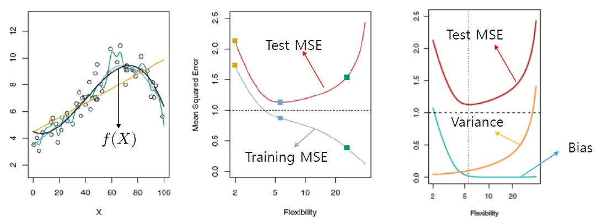

> Case 1

- flexibility가 증가할 때, 초기에 Bias가 급격히 감소 --> test MSE도 급격히 감소
- 일정 지점 이후에 Variance에 의해 test MSE가 빠르게 증가

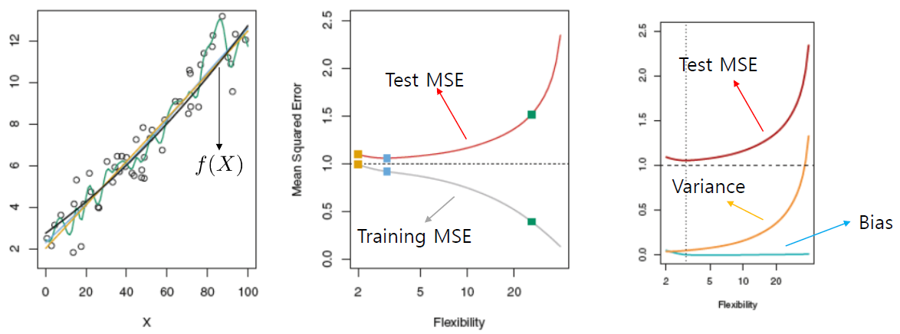

> Case 2 : True *f*가 선형에 가까울 경우

- flexibility가 증가함에 따라 편향의 감소(True *f*가 매우 선형적이기 때문)
- test MSE는 flexibility이 증가할때 분산이 증가함에 따라 빠르게 증가한다.

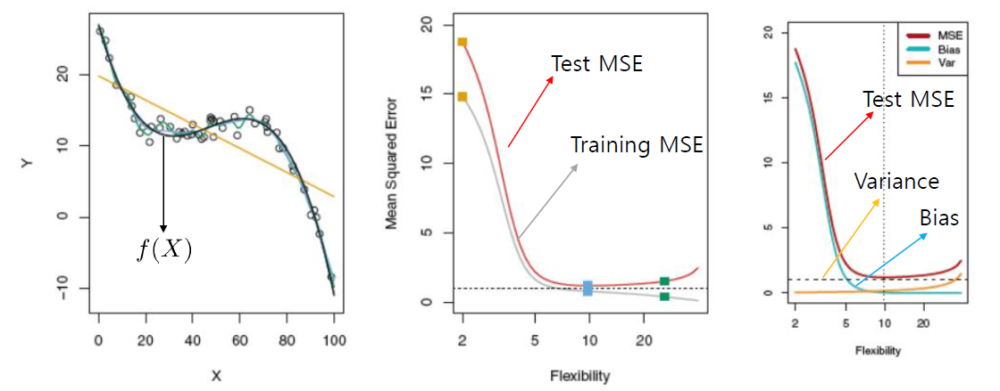

> Case 3 : True *f*가 아주 비선형적

- flexibility가 증가함에 따라 편향은 급격히 감소(True *f*가 매우 비선형적이기 때문)
- flexibility가 증가해도 분산의 증가는 거의 없다.
- test MSE는 flexibility가 증가함에 따라 현저히 줄어들다가 다시 약간 증가한다.

세 경우 모두 flexibility 증가함에 따라 Bias는 감소하고, Variance는 증가한다.

하지만, 각각 최적의 test MSE를 제공하는 flexibility는 다르다!

--> 각 자료마다 Bias와 Variance의 변화 속도가 다르기 때문!

위 그래프와 아까 보았던 이 식,

으로 알 수 있는 Variance, Bias, 그리고 test MSE의 관계를 **Trade-Off(절충)**라고 한다.

**Why Trade-Off?**

- Variance와 Bias중 각각 하나가 매우 낮고 다른 하나가 매우 높은 방법은 어렵지 않음.
- 좋은 성능을 위한, 즉 Variance 와 Bias를 동시에 낮게 만드는 방법을 찾는 것은 어렵기 때문이다.

True *f*를 모르는 실제 상황에서는 test MSE, Variance, Bias의 명시적 계산은 불가능, but 항상 염두해두자!

### 2.2.3 The Classification Setting

지금까지 모델 정확도에 대한 논의는 Regression에 중점, 이를 Classification에 적용해보자.

train data ,(x_{1},y_{1}),...,(x_{n},y_{n}))을 기반으로 *f*를 추정한다고 했을 때(are qualitative) 의 정확도를 수량화 하는 가장 흔한기법은, 다음 식으로 나타내어지는 *training error rate*이다.

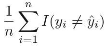

-  : 을 사용하여 예측된 i번째 관측치에 대한 클래스 표시
- (*indicator variable*) : 이면 1, 이면 0
- 잘못된 비율을 계산

앞과 마찬가지 접근으로, 우리는 train error rate 보다 다음과 같이 정의되는 test error rate에 관심!

])

#### The Bayes Classifier

test error rate는 **"주어진 설명변수 값에 대해 가장 가능성이 높은(most likely) 클래스에 각 관측치를 할당"**하는 매우 단순한 분류기인 Bayes Classifier에 의해 최솟값을 얻을 수 있다.(no proof in ISLR)

**Bayes Classifier**는 설명변수가 를 가지는 관측치를 다음과 같은 조건부 확률

)

를 **최대로 하는 클래스 j에 할당**하는 단순한 분류기이다. 

e.g. 0,1로 분류하는 2-class problem : >0.5)면 클래스 1, 그렇지 않으면 클래스 0 예측

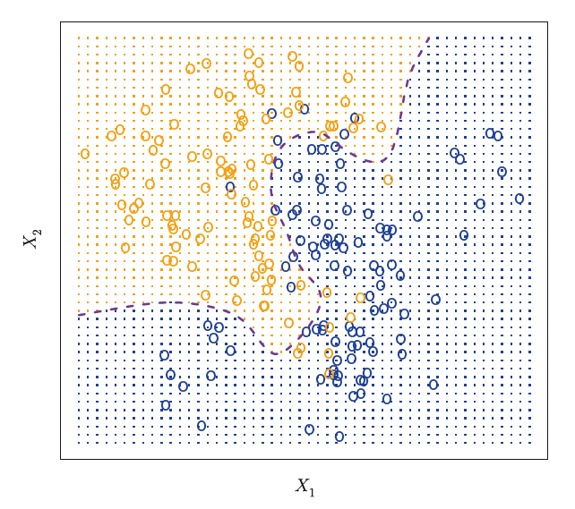

- 오렌지영역은 X1 X2에 대해 )가 50%보다 큰 점들의 집합
- 파랑영역은 50%보다 낮은 점들의 집합
- 보라색 파선은 이 확률이 50%인 점들이고, 이것을 Bayes decision boundary(베이즈 결정경계)라고 한다.
- Bayes Classifier의 예측은 이 decision boundary에 의해 결정된다.

Bayes error rate은 가능한 검정 오차율 중에서 가장 낮은 값이다.

X = 에서의 오차율은 )이고, 전체 베이즈 오차율은 다음과 같다.

위의 예에서, Bayes error rate은 0.1304이다.(0보다 큰 이유는 실제 모집단에서는 클래스가 겹쳐져서(overlap) 일부 에 대해 <1)이기 때문이다.???)

**Bayes Classifier는 이론상 최강의 분류기이다. 하지만 현실에서는?**

X에 대한 Y의 조건부분포 모름 --> 베이즈 분류기 계산 불가

그러므로, Bayes Classifier는 Regression에서의 True *f*처럼 달성할 수 없는 표준, 궁극의 역할을 한다.

따라서, 위의 Bayes error rate은 irreducible error로 간주할 수 있다.

#### K-Nearest Neighbors

우리는 Bayes 분류기 처럼 X에 대한 Y의 조건부분포 모르기 때문에, 많은 Classification의 기법들은 그 조건부분포를 추정하여 가장 높은 추정확률(highest estimated probability)을 가지는 클래스로 관측치를 분류!

그 중 하나가 K-Nearest Neighbors(KNN)이다!

KNN은 3단게로 나눌 수 있다. 양의 정수 K와 검정 관측치 에 대해

1. train data에서 에 가장 가까운 K개의 점(로 표시)을 식별
2. 클래스 j에 대한 조건부 확률을 반응변수 값이 k인 내 점들의 비율로 추정한다, 이렇게!

3. 마지막으로 베이즈 분류기와 같은 규칙으로 확률이 가장 높은 클래스 j에 할당한다.

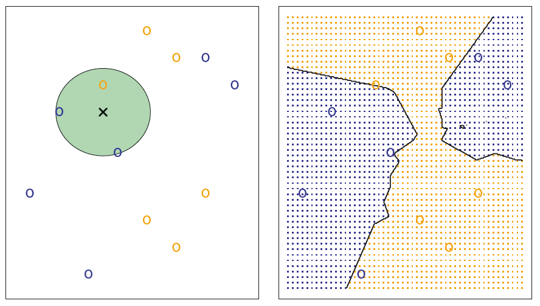

위 그림은 KNN기법의 한 예로, K=3을 선택했을 경우이다.

1. 검은색 X표시와 가장 가까운 3개의 점을 식별
2. 3개의 점 내에서 오렌지색, 파랑색 점의 비율로 조건부확률 추정(이경우 1/3, 2/3)
3. 확률이 더 높은 파랑색 점으로 X를 할당

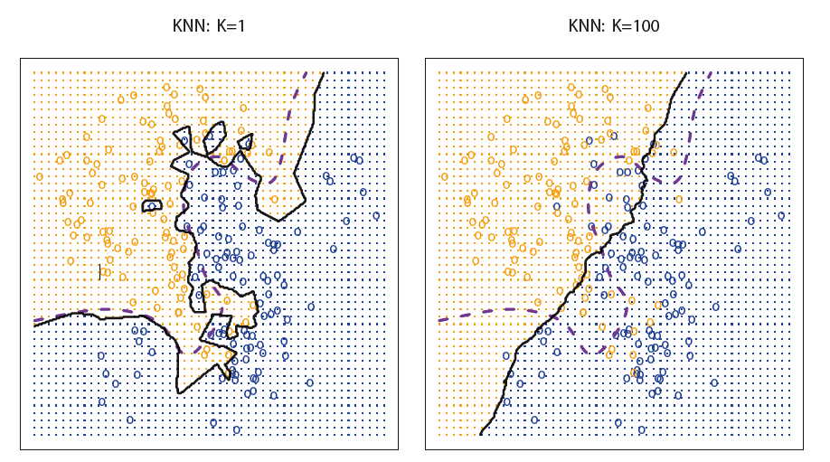

위의 두 사진은 K=1, K=100을 사용한 두가지 KNN적합이다.

> K가 1에 가까울수록

- decision boundary는 매우 유연해지고, 편향은 낮지만 분산은 높다.
- train error rate 이 매우 낮아진다.
- test error rate은 글쎄..?

> K가 증가할수록

- decision boundary는 덜 유연해지고, 분산은 낮지만 편향은 높다.

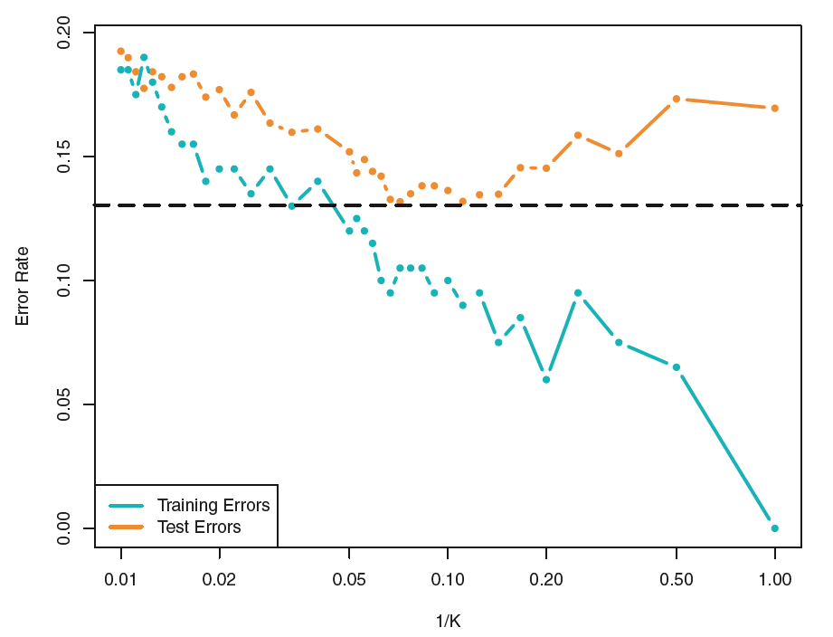

위 사진은 Train Error Rate과 Test Error Rate을 1/K의 함수이다.(그래프에 우측으로 갈수록 유연)

Test Error Rate은 적절한 값에서 최소를 갖는 U자형의 그래프를 가진다.

#### 결론

결론적으로, Regression이든 Classification에서 올바른 수준의 유연성을 선택하는 것은 매우 중요하다.

Variance와 Bias의 Trade-Off 관계와, test MSE(error rate)의 U자형 그래프를 항상 머릿속에 염두하자.

5장에서 어떻게하면 최적의 flexibility를 추정할 수 있는지 더 공부해보자!.